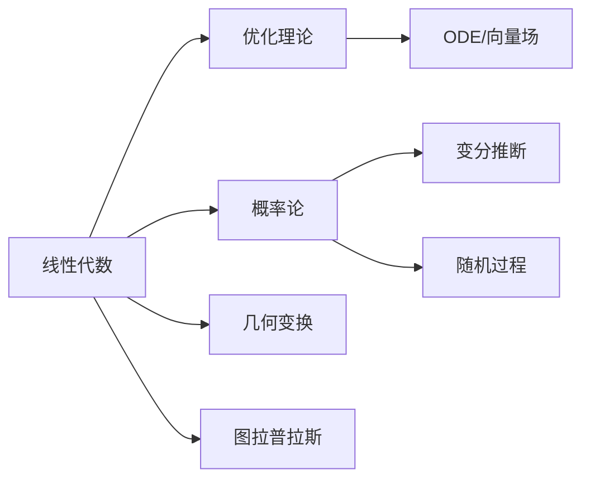

# Part 1 · 数学基础

深度学习的本质是在高维空间里做优化。读懂论文里的公式，需要三块数学：线性代数（描述数据和变换）、概率论（描述不确定性）、优化理论（描述如何训练）。

本章不追求数学严谨，目标是让你"用得上"。所有符号约定见本页末尾的符号表，后续章节的公式与此保持一致。

## 本章知识地图

## 你将学到

| 章节 | 核心内容 | 被哪些后续章节引用 |
|------|----------|--------------------|
| [线性代数](linear-algebra/index.md) | 矩阵运算、求导、SVD、几何变换、图矩阵 | 全部章节 |
| [概率论](probability/index.md) | 分布、贝叶斯、信息论、随机过程、ELBO | 生成模型、RL、3DV |
| [优化理论](optimization/index.md) | 梯度下降、Adam、KKT、ODE | 训练相关全部章节 |

## 全局符号约定

| 符号 | 含义 |
|------|------|
| $\mathbf{x}, \mathbf{y}$ | 向量（粗体小写） |
| $\mathbf{W}, \mathbf{A}$ | 矩阵（粗体大写） |
| $\mathcal{L}$ | 损失函数 |
| $\theta$ | 模型参数 |
| $p(\cdot), q(\cdot)$ | 概率分布 |
| $\mathbb{E}[\cdot]$ | 期望 |
| $\nabla_\theta$ | 对 $\theta$ 求梯度 |
| $\|\cdot\|_2$ | L2 范数 |
| $\mathbb{R}^{m \times n}$ | $m \times n$ 实数矩阵空间 |
