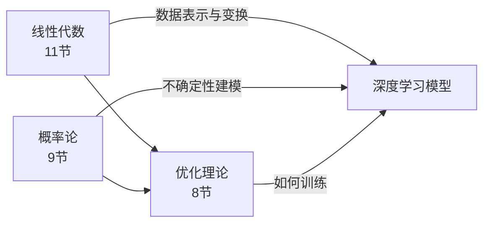

# Part 1 · 数学基础

深度学习的本质是在高维空间里做优化。读懂论文里的公式，需要三块数学：线性代数（描述数据和变换）、概率论（描述不确定性）、优化理论（描述如何训练）。

本章共 **27 个小节**，每节专注一个概念，顺序经过仔细设计——每节只依赖前面已学的内容，不会出现"先用后讲"的情况。

## 三块数学的定位

## 章节速览

| 章节 | 小节数 | 核心内容 | 主要引用章节 |
|------|--------|----------|-------------|
| [线性代数](linear-algebra/index.md) | 11 | 矩阵运算 → 求导 → 分解 → 几何变换 | 全部 |
| [概率论](probability/index.md) | 9 | 分布 → 推断 → 信息论 → 随机过程 → ELBO | 生成模型、RL、3DV |
| [优化理论](optimization/index.md) | 8 | 梯度 → 收敛 → 约束 → 插值 → ODE | 训练、机器人控制 |

## 全局符号约定

后续所有章节的公式符号与本表一致，遇到符号冲突会在章节开头显式说明。

| 符号 | 含义 |
|------|------|
| $\mathbf{x}, \mathbf{y}, \mathbf{z}$ | 向量（粗体小写） |
| $\mathbf{W}, \mathbf{A}, \mathbf{H}$ | 矩阵（粗体大写） |
| $\mathcal{L}$ | 损失函数 |
| $\theta, \phi$ | 模型参数 |
| $p(\cdot), q(\cdot)$ | 概率分布 |
| $\mathbb{E}_{p}[\cdot]$ | 在分布 $p$ 下的期望 |
| $\nabla_\theta \mathcal{L}$ | 损失对参数的梯度 |
| $\|\mathbf{x}\|_2$ | L2 范数（欧氏长度） |
| $\|\mathbf{A}\|_F$ | Frobenius 范数 |
| $\mathbb{R}^{m \times n}$ | $m \times n$ 实数矩阵空间 |
| $\mathbf{I}_n$ | $n \times n$ 单位矩阵 |
| $\mathbf{A}^\top$ | 矩阵转置 |
| $\mathbf{A}^{-1}$ | 矩阵逆 |
| $\det(\mathbf{A})$ | 矩阵行列式 |
| $\text{tr}(\mathbf{A})$ | 矩阵迹 |
| $\text{KL}(p \| q)$ | KL 散度 |
| $\mathcal{N}(\mu, \sigma^2)$ | 均值 $\mu$、方差 $\sigma^2$ 的高斯分布 |
