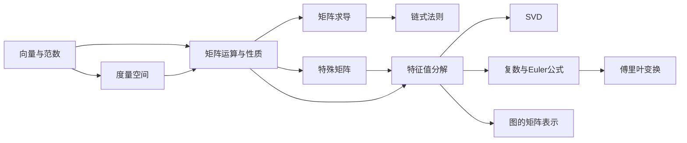

# 线性代数

矩阵是深度学习的基本语言：数据是矩阵，权重是矩阵，注意力分数也是矩阵。这一章专注于**代数运算和分解**，空间几何部分已独立成章（见「几何基础」）。

## 本章知识地图

## 你将学到

| 小节 | 核心内容 | 被引用于 | 前置依赖 |
|------|----------|----------|----------|
| [向量与范数](vectors-spaces.md) | 向量空间、内积、L1/L2/Frobenius 范数 | 全部 | 无 |
| [度量空间](metric-spaces.md) | 度量的一般定义、L1/L2/余弦距离的几何含义 | ANN/HNSW、隐空间 | 向量与范数 |
| [矩阵运算与性质](matrix-ops.md) | 迹、行列式、秩、矩阵乘法技巧 | 全部 | 向量与范数 |
| [特殊矩阵](special-matrices.md) | 对称、正定、正交、投影矩阵 | 优化、几何变换 | 矩阵运算 |
| [矩阵求导](matrix-calculus.md) | 标量/向量/矩阵对向量求导、Jacobian、Hessian | 反向传播、优化 | 矩阵运算 |
| [链式法则（矩阵形式）](chain-rule.md) | 矩阵版链式法则 | 反向传播 | 矩阵求导 |
| [特征值分解](eigenvalue.md) | 特征值、特征向量、谱定理 | 优化、PCA、GNN | 特殊矩阵 |
| [SVD 与低秩近似](svd.md) | 奇异值分解、低秩近似、LoRA 的数学基础 | LoRA、NeRF | 特征值分解 |
| [复数与 Euler 公式](complex-numbers.md) | 复平面、$e^{i\theta}$、四元数代数引子、RoPE 基础 | Transformer 位置编码、几何变换 | 特征值分解 |
| [傅里叶变换](fourier.md) | DFT/FFT/STFT、频域直觉 | 语音处理、RoPE、FNO | 复数与 Euler 公式 |
| [图的矩阵表示](graph-laplacian.md) | 邻接矩阵、度矩阵、拉普拉斯矩阵、谱分解 | GNN | 特征值分解 |
