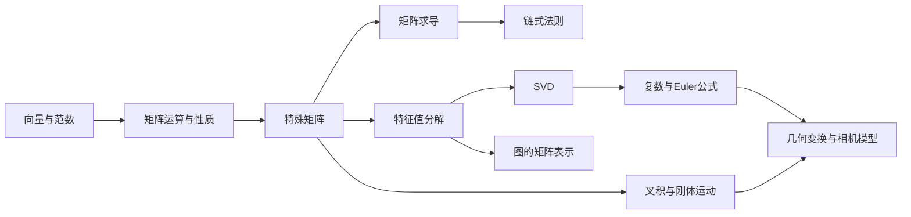

# 线性代数

矩阵是深度学习的基本语言：数据是矩阵，权重是矩阵，注意力分数也是矩阵。这一章从基础工具出发，逐层递进到科研中真正会用到的高级技巧。

## 本章知识地图

## 你将学到

| 小节 | 核心内容 | 被引用于 | 前置依赖 |
|------|----------|----------|----------|
| [向量与范数](vectors-spaces.md) | 向量空间、内积、L1/L2/Frobenius 范数 | 全部 | 无 |
| [矩阵运算与性质](matrix-ops.md) | 迹、行列式、秩、矩阵乘法技巧 | 全部 | 向量 |
| [特殊矩阵](special-matrices.md) | 对称、正定、正交、投影矩阵 | 优化、几何变换 | 矩阵运算 |
| [矩阵求导](matrix-calculus.md) | 标量/向量/矩阵对向量求导、Jacobian、Hessian | 反向传播、优化 | 矩阵运算 |
| [链式法则（矩阵形式）](chain-rule.md) | 矩阵版链式法则 | 反向传播 | 矩阵求导 |
| [特征值分解](eigenvalue.md) | 特征值、特征向量、谱定理 | 优化、PCA、GNN | 特殊矩阵 |
| [SVD 与低秩近似](svd.md) | 奇异值分解、低秩近似、LoRA 的数学基础 | LoRA、NeRF | 特征值 |
| [复数与 Euler 公式](complex-numbers.md) | 复平面、$e^{i\theta}$、四元数的引子、RoPE 的基础 | Transformer 位置编码、四元数 | SVD |
| [叉积与刚体运动基础](rigid-body-basics.md) | 向量叉积、角速度、力矩、惯量张量直觉 | 机器人动力学 | 特殊矩阵 |
| [几何变换与相机模型](geometry-transforms.md) | 齐次坐标、旋转矩阵、四元数、SO(3)/SE(3)、投影变换 | 3DV、等变网络、机器人运动学 | 复数、特殊矩阵 |
| [图的矩阵表示](graph-laplacian.md) | 邻接矩阵、度矩阵、拉普拉斯矩阵、谱分解 | GNN | 特征值 |
