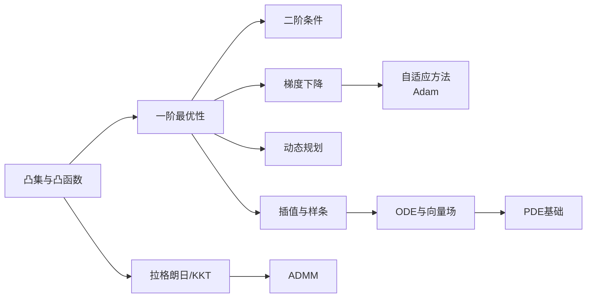

# 优化理论

训练神经网络本质上是在高维空间里求最小值。这一章从凸函数的性质出发，讲到 Adam 的工作原理，再到约束优化、插值和连续动力学——覆盖后续所有训练与控制章节的数学基础。

## 本章知识地图

## 你将学到

| 小节 | 核心内容 | 被引用于 | 前置依赖 |
|------|----------|----------|----------|
| [凸集与凸函数](convex-basics.md) | 凸性定义、Jensen 不等式、局部=全局最小 | 优化分析 | 线性代数 |
| [一阶最优性](first-order.md) | 梯度、方向导数、驻点条件 | 全部训练章节 | 矩阵求导 |
| [二阶条件与曲率](second-order.md) | Hessian、正定性、鞍点问题 | 优化分析 | 一阶最优性 |
| [梯度下降与收敛性](gradient-descent.md) | GD / Mini-batch SGD / SGD、学习率、收敛分析 | 神经网络训练 | 一阶最优性 |
| [自适应优化方法](adaptive-methods.md) | Momentum、AdaGrad、RMSProp、Adam | 所有训练 | 梯度下降 |
| [动态规划](dynamic-programming.md) | 最优子结构、Bellman 方程、值函数近似桥梁 | RL 全章 | 一阶最优性 |
| [拉格朗日乘子与 KKT](lagrangian.md) | 约束优化、KKT 条件、对偶问题 | PPO、操作空间控制 | 凸函数 |
| [ADMM 及相关算法](admm.md) | 增广拉格朗日、交替方向乘子、近端梯度、LASSO | 分布式优化、稀疏学习 | 拉格朗日/KKT |
| [插值与样条基础](interpolation.md) | 多项式插值、三次样条、轨迹平滑 | 机器人轨迹规划 | 一阶最优性 |
| [ODE 与向量场基础](odes-vector-fields.md) | 常微分方程直觉、向量场、数值求解器 | Flow Matching、动力学 | 一阶最优性 |
| [PDE 基础](pdes.md) | PDE 与 ODE 的区别、热方程、PINN 出发点 | AI4Science、Flow Matching | ODE 与向量场 |
