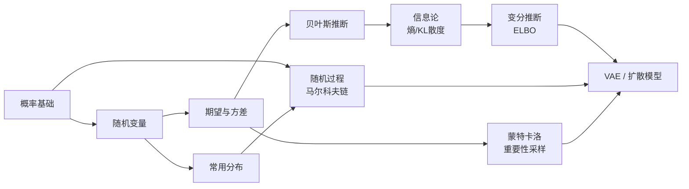

# 概率论

生成模型、损失函数、贝叶斯方法——这些都是概率论的语言。这一章打通概率基础和深度学习的连接。

## 本章知识地图

## 你将学到

| 小节 | 核心内容 | 前置依赖 |
|------|----------|----------|
| [概率基础](basics.md) | 概率公理、条件概率、贝叶斯公式 | 无 |
| [随机变量](random-variables.md) | 离散/连续变量、PDF/PMF/CDF | 概率基础 |
| [常用分布](distributions.md) | 高斯、伯努利、范畴、Beta、Dirichlet | 随机变量 |
| [期望与方差](expectation-variance.md) | 期望、方差、协方差矩阵 | 随机变量 |
| [贝叶斯推断](bayesian.md) | 先验/后验、MLE vs MAP | 期望与方差 |
| [信息论](information-theory.md) | 熵、交叉熵、KL 散度、互信息 | 贝叶斯推断 |
| [随机过程与马尔科夫链](stochastic-processes.md) | 随机过程、马尔科夫性、平稳分布、SDE 直觉 | 概率基础、常用分布 |
| [蒙特卡洛与重要性采样](sampling.md) | MC 估计、重要性采样、方差减小 | 期望与方差 |
| [变分推断与 ELBO](variational-inference.md) | 变分推断框架、ELBO 推导、重参数化预备 | 信息论、KL 散度 |
