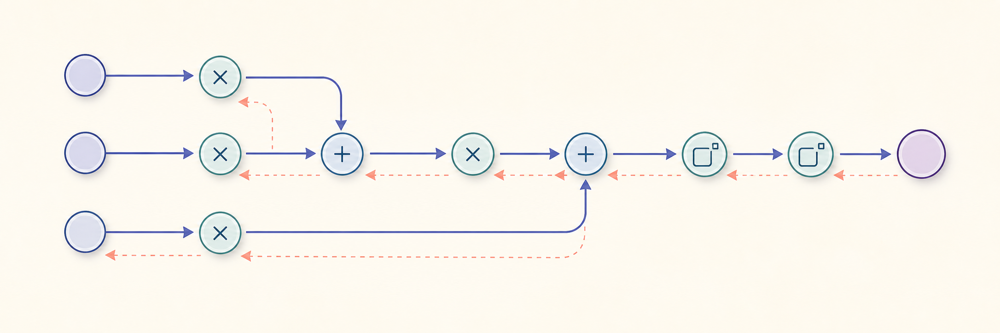
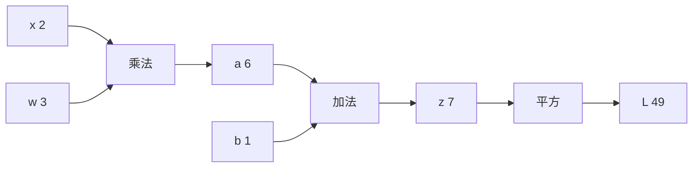
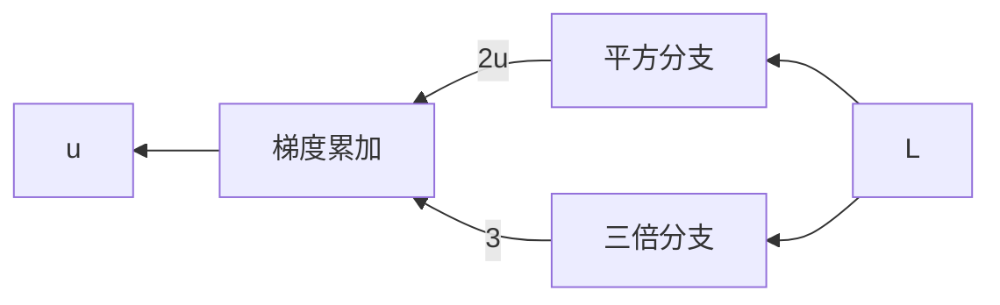

# 计算图与自动微分



*图 1：这是前向计算与反向传递的概念性总览；准确的计算图见下文。*

!!! info "参考资料"
    - [Autograd mechanics](https://docs.pytorch.org/docs/stable/notes/autograd.html) — PyTorch Documentation
    - [Deep Learning](https://www.deeplearningbook.org/) — 第 6.5 节

## 直觉 (Intuition)

一个损失函数写在纸上可能很长，程序执行时却只是乘、加、平方等小操作的接力。计算图把这些操作和中间结果记下来。这样一来，前向时算出损失，反向时就能逐个节点回答：这里变一点，损失会变多少？

自动微分做的正是这件事。它不是把整个式子交给符号工具化简，也不是靠有限差分猜导数；它沿着实际执行过的操作，重复使用链式法则。

## 把表达式拆成节点

先看一个只有标量的例子：

$$
a=wx,\qquad z=a+b,\qquad L=z^2.
$$

令 $x=2$、$w=3$、$b=1$。先从左向右代入：$a=6$，再得到 $z=7$，最后 $L=49$。这就是前向计算；它不神秘，就是按依赖关系把中间值算出来。

下面的图只保留了依赖和数值。公式仍放在 LaTeX 中，避免图中的排版把数学关系说模糊。



现在从 $L$ 往回看。反向计算先放一个单位的上游梯度 $\partial L/\partial L=1$ 在终点。到每个节点时，只做两件小事：把上游梯度乘上该节点的局部导数，再把结果交给它的输入。对本例来说：

$$
\frac{\partial L}{\partial z}=2z=14,
$$

$$
\frac{\partial L}{\partial a}
=\frac{\partial L}{\partial z}\frac{\partial z}{\partial a}
=14,
$$

$$
\frac{\partial L}{\partial w}
=\frac{\partial L}{\partial a}\frac{\partial a}{\partial w}
=14x=28.
$$

所以 $w$ 增加一点点时，$L$ 大约以 $28$ 倍的速度增加。这里没有重新展开整个复合函数；每个节点只知道自己的局部规则，接住并传递信息即可。这一页到此只讨论标量的局部导数。向量–雅可比积和完整的 reverse-mode 推导留在[反向传播](../03-training/backpropagation.md)。

## 分支处为什么要相加

一个变量也可能被用两次。设：

$$
L=u^2+3u.
$$

从反向方向看，平方分支和线性分支各自传回一份贡献；两份贡献先累加，再交给 $u$。



两份贡献的具体数值仍由局部导数给出：

$$
\frac{\partial L}{\partial u}=2u+3.
$$

也就是说，平方分支贡献 $2u$，线性分支贡献 $3$，总梯度是它们的和。这正是 PyTorch 默认累积梯度的数学原因：同一个参数若在一次前向计算中多次被使用，不能只保留其中一条路径的结果。

## 自动微分和数值微分不同

有限差分用

$$
\frac{f(x+\varepsilon)-f(x-\varepsilon)}{2\varepsilon}
$$

近似导数，会有截断误差和浮点误差。自动微分对基本操作使用精确导数，再通过链式法则组合；误差只来自普通浮点计算。有限差分仍适合做 gradient check，但不适合日常训练。

```python
import torch

w = torch.tensor(3.0, requires_grad=True)
x = torch.tensor(2.0)
b = torch.tensor(1.0)
loss = (w * x + b) ** 2
loss.backward()

print(w.grad)  # tensor(28.)
```

`requires_grad=True` 表示需要记录与 $w$ 有关的操作；`backward()` 从标量损失反向计算梯度。中间图何时保存、梯度为何清零，会在[反向传播](../03-training/backpropagation.md)和[训练循环](../03-training/minibatch-and-training-loop.md)中说明。

!!! warning "常见误区"
    自动微分算的是当前执行路径的导数。包含条件分支时，没走到的分支不在这次计算图里；这不是漏算，而是这次程序实际定义的函数就没有经过那条分支。
