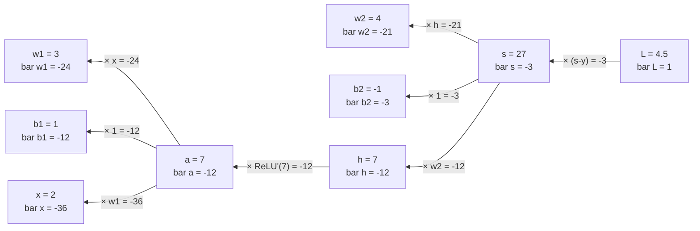

# 反向传播

!!! info "参考资料"
    - [Deep Learning](https://www.deeplearningbook.org/) — 第 6.5 节
    - [Autograd mechanics](https://docs.pytorch.org/docs/stable/notes/autograd.html) — PyTorch Documentation

## 直觉 (Intuition)

前向传播回答“参数现在给出什么预测”，反向传播回答“每个参数动一点，损失会怎样变”。如果把复合函数直接展开再求导，相同的中间导数会被反复计算。反向模式自动微分从标量损失出发，把每个节点收到的梯度只汇总一次，再乘局部导数送往上游；神经网络的反向传播就是这套过程在层状计算图上的名字。

先约定记号：对任意中间量 $v$，写

$$
\bar v=\frac{\partial L}{\partial v}.
$$

$\bar v$ 常叫伴随量或上游梯度。它说的是损失对 $v$ 的敏感度，不是 $v$ 所在节点自己的局部导数。

## 一个两层标量网络

用一个能手算完的网络看清全过程：

$$
a=w_1x+b_1,\qquad h=\operatorname{ReLU}(a),
$$

$$
s=w_2h+b_2,\qquad L=\frac12(s-y)^2.
$$

取 $x=2,w_1=3,b_1=1,w_2=4,b_2=-1,y=30$。前向计算得到 $a=7,h=7,s=27,L=4.5$。因为 $a>0$，本次执行路径上 $\operatorname{ReLU}'(a)=1$。

下面是这次计算**精确对应**的反向图。节点同时标出前向值与收到的梯度；边上的乘数是局部导数，等号右边是传回的结果。



按相同顺序写成链式法则就是：

$$
\bar s=s-y=-3,
$$

$$
\bar w_2=\bar s\,h=-21,\qquad
\bar b_2=\bar s=-3,\qquad
\bar h=\bar s\,w_2=-12,
$$

$$
\bar a=\bar h\,\operatorname{ReLU}'(a)=-12,
$$

$$
\bar w_1=\bar a\,x=-24,\qquad
\bar b_1=\bar a=-12.
$$

例如 $w_1$ 稍微增大，当前损失会下降，所以梯度为负。优化器沿负梯度更新时反而会增大 $w_1$；符号与直觉一致。

## 反向模式怎样复用计算

反向传播需要前向时的 $x,h,w_2$ 等值，因此框架通常保存反向公式需要的中间量。调用反向计算后，图和缓存往往可以释放。若一边保留所有计算图、一边不断追加新迭代，显存会随迭代增长；把用于日志的损失张量长期保存也可能意外保住整张图。

一个变量若流向多条分支，传回的贡献必须相加。设 $u$ 同时进入 $p=u^2$ 与 $q=3u$，则 $L=p+q$ 给出

$$
\bar u=\bar p\frac{\partial p}{\partial u}
+\bar q\frac{\partial q}{\partial u}=2u+3.
$$

“乘局部导数”处理一条边，“在汇合点求和”处理多条路径。这也解释了参数共享为何可训练：同一个权重在多个位置使用时，各位置的梯度贡献会累加到同一参数。

## 从标量到向量—雅可比积

神经网络节点通常是向量。令 $\mathbf y=f(\mathbf x)$，其中 $\mathbf x\in\mathbb R^n$、$\mathbf y\in\mathbb R^m$，局部雅可比矩阵为

$$
\mathbf J_f=\frac{\partial\mathbf y}{\partial\mathbf x}\in\mathbb R^{m\times n}.
$$

损失 $L$ 最终仍是标量。若梯度用列向量表示，反向一步为

$$
\nabla_{\mathbf x}L
=\mathbf J_f^\top\nabla_{\mathbf y}L.
$$

在本页的列梯度约定下，反向计算是“局部雅可比转置乘上游列梯度”，即 $\mathbf J_f^\top\nabla_{\mathbf y}L$。若把上游梯度写成行协向量，同一个运算就是通常所说的向量—雅可比积 (vector–Jacobian product, VJP)：

$$
(\nabla_{\mathbf y}L)^\top\mathbf J_f.
$$

两种写法互为转置，得到的分量相同。框架只求这个乘积，不必构造可能很大的完整雅可比。

以线性层 $\mathbf y=\mathbf W\mathbf x+\mathbf b$ 为例，收到 $\bar{\mathbf y}=\nabla_{\mathbf y}L$ 后：

$$
\nabla_{\mathbf x}L=\mathbf W^\top\bar{\mathbf y},\qquad
\nabla_{\mathbf W}L=\bar{\mathbf y}\mathbf x^\top,\qquad
\nabla_{\mathbf b}L=\bar{\mathbf y}.
$$

若 $\mathbf W$ 形状为 $d_{out}\times d_{in}$，三项形状依次是 $d_{in}$、$d_{out}\times d_{in}$、$d_{out}$。反向代码出错时，先核对这三个形状，比盯着展开后的下标更有效。

## 用自动微分核对手算

```python
import torch

x = torch.tensor(2.0)
w1 = torch.tensor(3.0, requires_grad=True)
b1 = torch.tensor(1.0, requires_grad=True)
w2 = torch.tensor(4.0, requires_grad=True)
b2 = torch.tensor(-1.0, requires_grad=True)
y = torch.tensor(30.0)

h = torch.relu(w1 * x + b1)
score = w2 * h + b2
loss = 0.5 * (score - y) ** 2
loss.backward()

print(loss.item())                 # 4.5
print(w1.grad, b1.grad)            # tensor(-24.) tensor(-12.)
print(w2.grad, b2.grad)            # tensor(-21.) tensor(-3.)
```

自动微分省掉的是机械计算，不是数学含义。`backward()` 仍按图执行上面的 VJP；叶子参数的 `.grad` 默认做加法累积，因此真正训练时需要决定何时清零。完整状态顺序见[Mini-batch 与训练循环](./minibatch-and-training-loop.md)。

!!! tip "面试 / 工程重点"
    反向传播为什么适合神经网络训练？因为目标通常是一个标量损失、参数却很多。一次反向遍历可得到所有参数的梯度，代价通常与一次前向计算同量级，而不是为每个参数单独做一次前向差分。

!!! warning "梯度检查的边界"
    中心有限差分适合在小模型上核对实现，但 ReLU 的零点不可导，浮点步长也不能太大或太小。检查时避开折点、使用双精度，并比较相对误差；不要把有限差分当作训练算法。
