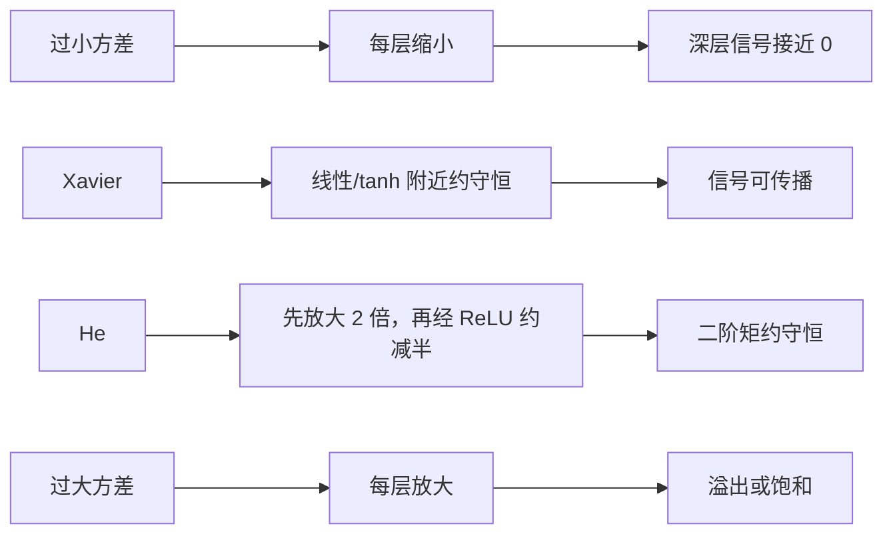

# 参数初始化

!!! info "参考资料"
    - Xavier Glorot, Yoshua Bengio, [Understanding the difficulty of training deep feedforward neural networks](https://proceedings.mlr.press/v9/glorot10a.html), AISTATS 2010
    - Kaiming He et al., [Delving Deep into Rectifiers](https://arxiv.org/abs/1502.01852), ICCV 2015
    - [torch.nn.init](https://docs.pytorch.org/docs/stable/nn.init) — PyTorch Documentation；`calculate_gain` 与 Kaiming 初始化参数约定

## 直觉 (Intuition)

初始化不是随便给参数一点随机噪声。信号每穿过一层，都会被许多权重相乘再相加；尺度若每层放大 2 倍，十层后约放大 $2^{10}$ 倍，激活和梯度很快溢出。若每层只保留一半，深层几乎看不到信号。Xavier 与 He 初始化的共同目标，是让典型信号的尺度跨层尽量保持在同一量级。

所有权重也不能设成同一个值。若一层的神经元初始权重完全相同，它们收到相同输入和梯度，更新后仍然相同；宽度虽然写了很多个单元，实际只学出一份特征。随机性首先用来打破这种对称。

## 线性层的方差怎样传播

先看一个输出单元：

$$
z=\sum_{i=1}^{n}w_ix_i.
$$

假设 $w_i$ 与 $x_i$ 相互独立、均值为零，各维同分布，偏置初始为零，则交叉项的期望消失：

$$
\operatorname{Var}(z)
=n\operatorname{Var}(w)\operatorname{Var}(x).
$$

$n$ 就是 `fan_in`，即一个输出单元接收的输入数。要让线性变换前后的方差近似不变，最直接的选择是

$$
\operatorname{Var}(w)\approx\frac1{\text{fan\_in}}.
$$

反向传播也有相似的乘加结构，但它更受 `fan_out` 影响。只保前向或只保反向都可能让另一方向逐层漂移，这引出了折中方案。

## Xavier：兼顾前向与反向

Xavier（也叫 Glorot）初始化取

$$
\operatorname{Var}(w)=\frac{2}{\text{fan\_in}+\text{fan\_out}}.
$$

当输入输出宽度相同，它退化为 $1/\text{fan\_in}$。这项推导更适合线性、tanh 一类在零点附近近似线性的激活。常见正态版本的标准差为上式开方；均匀版本若 $w\sim U[-a,a]$，因为方差是 $a^2/3$，所以

$$
a=\sqrt{\frac{6}{\text{fan\_in}+\text{fan\_out}}}.
$$

把方差误当标准差会让权重尺度差一个平方根，这是手写初始化里很常见的错误。

## He：补偿整流激活改变的二阶矩

先写带负半轴斜率 $a$ 的整流函数：

$$
\phi_a(x)=\max(x,ax).
$$

若零均值对称输入有一半落在正区、一半落在负区，正半轴保留原值，负半轴的平方变成 $a^2x^2$，所以输出的**二阶矩**约乘 $(1+a^2)/2$。这里说二阶矩而非严格方差，因为整流后的输出通常不再零均值。为补偿这项变化，He 初始化取

$$
\operatorname{Var}(w)=\frac{2}{(1+a^2)\,\text{fan\_in}},
\qquad
\operatorname{Std}(w)=\sqrt{\frac{2}{(1+a^2)\,\text{fan\_in}}}.
$$

ReLU 是 $a=0$ 的特例，此时才得到熟悉的

$$
\operatorname{Var}(w)=\frac{2}{\text{fan\_in}}.
$$

LeakyReLU 使用固定负斜率；PReLU 的 $a$ 会学习，初始化只能按它的**初始值**计算。PyTorch 对 LeakyReLU 给出的 gain 正是 $\sqrt{2/(1+a^2)}$，Kaiming 正态初始化再除以 $\sqrt{\text{fan\_in}}$。若把 Xavier 用在很深的 ReLU 网络，信号可能逐层变弱；若把 He 机械套给 sigmoid，较大的初值又可能把单元推入饱和区。初始化应与[激活函数](../02-neural-network-foundations/activations.md)配套。

## 三种尺度的方差流

下表把输入方差记为 1，并假设连续层宽度相同。数值是用于理解趋势的近似，不是对真实网络分布的保证。

| 方案 | 单层近似倍率 | 经过 10 个线性/激活块 | 读到的现象 |
|---|---:|---:|---|
| 权重方差过小，如 $0.25/\text{fan\_in}$ | 约 $0.25$；接 ReLU 后更小 | 接近 0 | 激活与梯度逐层消失 |
| Xavier + 近线性激活 | 约 $1$ | 仍在同一量级 | 前向/反向较平衡 |
| He + ReLU | 线性约 $2$，ReLU 二阶矩约乘 $1/2$ | 约 $1$ | 补偿整流造成的衰减 |
| 权重方差过大，如 $4/\text{fan\_in}$ | 大于 $1$ | 快速放大 | 激活、梯度甚至损失溢出 |

可以把它读成一条紧凑的尺度流：



## 偏置、残差与实际边界

偏置通常初始化为零，因为权重随机性已经打破对称。少数结构会给门控偏置特殊初值，那是架构机制，不是所有层的通则。

上述推导依赖独立、零均值、相同分布等近似。卷积中的 `fan_in` 还包括卷积核空间大小；残差相加会改变方差；归一化层会重新调整激活尺度；很深网络有时还要对残差分支做深度相关缩放。因此 Xavier/He 是可靠起点，不是训练稳定性的证明。

```python
import torch
from torch import nn

relu_layer = nn.Linear(256, 512)
nn.init.kaiming_normal_(relu_layer.weight, mode="fan_in", nonlinearity="relu")
nn.init.zeros_(relu_layer.bias)

tanh_layer = nn.Linear(256, 512)
nn.init.xavier_uniform_(tanh_layer.weight)
nn.init.zeros_(tanh_layer.bias)

print(relu_layer.weight.shape)  # torch.Size([512, 256])
```

!!! tip "面试 / 工程重点"
    Xavier 与 He 的差别不只是一个常数。Xavier 在 `fan_in` 与 `fan_out` 间折中；He 针对整流激活丢掉部分二阶矩，用 $2/\text{fan\_in}$ 补偿。回答时要同时说出激活函数假设。

真正排查梯度异常时，应记录各层激活与梯度的分布并沿网络定位；完整排查路径留给[训练故障诊断](../06-evaluation-debugging/diagnosing-training.md)。初始化之后，参数怎样一步步移动，见[优化器与学习率](./optimization.md)。
