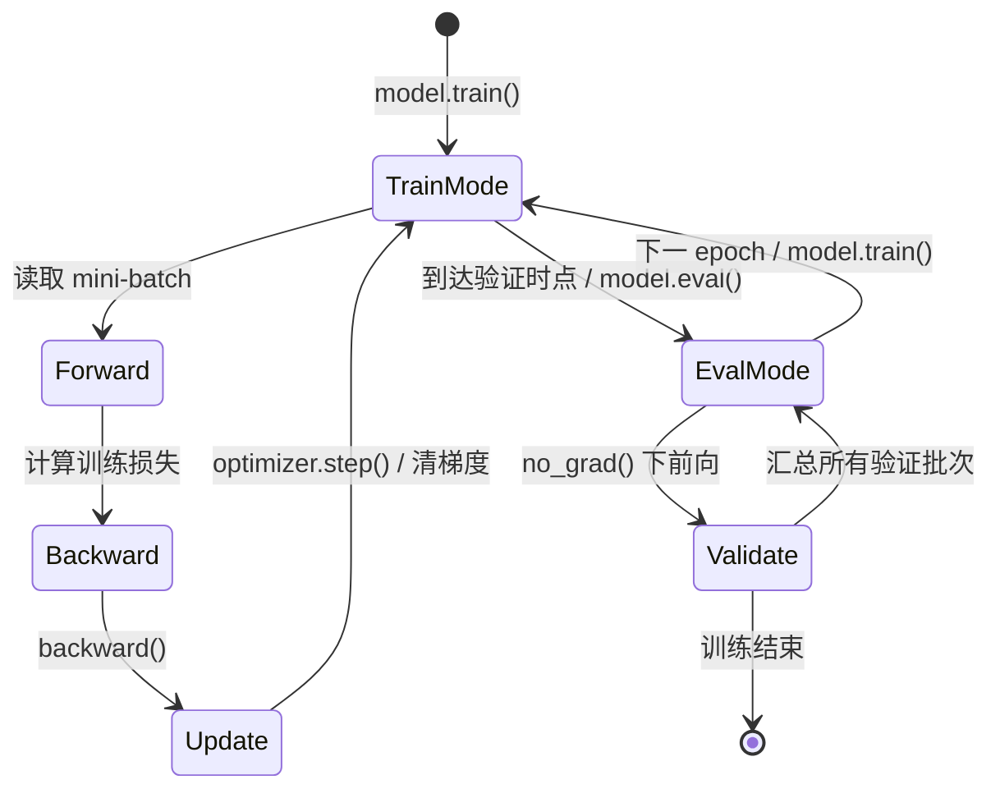

# Mini-batch 与训练循环

!!! info "参考资料"
    - [Module notes: training and evaluation modes](https://docs.pytorch.org/docs/stable/notes/modules.html) — PyTorch Documentation
    - [Locally disabling gradient computation](https://docs.pytorch.org/docs/stable/notes/autograd.html#locally-disabling-gradient-computation) — PyTorch Documentation

## 直觉 (Intuition)

一次参数更新只占训练的一小格。数据要先分批，每批做前向、算损失、反向，再由优化器更新；验证时又要切换层的行为、停止记录梯度。训练循环的难点不在 `for`，而在每种状态何时开始、何时结束。

先把几个容易混用的词固定下来。假设训练集有 1,000 个样本，batch size 为 100：

| 名词 | 含义 | 本例 |
|---|---|---|
| sample | 一条样本 | 1 条输入及标签 |
| mini-batch / batch | 一次前向与反向所用的一组样本 | 100 条 |
| step / iteration | 一次优化器参数更新 | 通常每个 batch 1 次，共 10 次/epoch |
| epoch | 训练数据大致完整遍历一次 | 1,000 条都参与后结束 |

最后一个 batch 可能不足 100 条；数据增强和有放回采样也会让“一个 epoch 看过每条样本一次”不再严格成立。工程上，epoch 是数据加载器完成一次迭代，step 才是调度器和检查点更稳定的时间坐标。

## 一批数据产生什么梯度

批大小为 $B$ 时，通常先对单样本损失取平均：

$$
L_{\mathcal B}(\theta)=\frac1B\sum_{i\in\mathcal B}\ell_i(\theta),
\qquad
g_{\mathcal B}=\nabla_\theta L_{\mathcal B}.
$$

批越小，每一步便宜但梯度噪声更大；批越大，梯度估计通常更平稳，却更耗显存，而且每个 epoch 的更新次数减少。完整的随机梯度理论与 batch-size 权衡见 Part 1 的[梯度下降](../../01-math/optimization/gradient-descent.md)。这里更重要的是：改变 batch size 常常也改变合适的学习率与训练步数，不能只替换一个数字后直接比较结果。

## 训练和验证是两条状态路径



`model.train()` 与 `model.eval()` 控制模块行为。Dropout 在训练模式随机置零，在评估模式关闭；BatchNorm 在训练模式使用当前 batch 统计量并更新运行统计，在评估模式使用已保存的运行统计量。

`no_grad()` 控制的是自动微分记录。它减少验证阶段的内存和计算开销，但不会自动把 Dropout 或 BatchNorm 切到评估行为。反过来，`model.eval()` 也不会关闭梯度记录。这两个开关正交，验证时通常都要用。

## 一个完整但最小的 PyTorch 循环

下面只出现一次全循环。损失函数接收 logits，验证指标按样本数加权，避免最后一个小 batch 扭曲均值。

```python
import torch
from torch import nn

model = nn.Sequential(nn.Linear(20, 64), nn.ReLU(), nn.Dropout(0.2), nn.Linear(64, 3))
criterion = nn.CrossEntropyLoss()
optimizer = torch.optim.AdamW(model.parameters(), lr=3e-4, weight_decay=1e-2)
scheduler = torch.optim.lr_scheduler.CosineAnnealingLR(optimizer, T_max=20)

for epoch in range(20):
    model.train()                         # 恢复 Dropout/BatchNorm 的训练行为
    train_loss_sum = 0.0

    for inputs, targets in train_loader:
        optimizer.zero_grad(set_to_none=True)  # 梯度默认累积；本批开始前清掉旧值
        logits = model(inputs)
        loss = criterion(logits, targets)
        loss.backward()
        optimizer.step()
        train_loss_sum += loss.item() * inputs.size(0)

    model.eval()                          # 固定 Dropout/BatchNorm 的评估行为
    valid_loss_sum = 0.0
    with torch.no_grad():                 # 验证不需要构建反向图
        for inputs, targets in valid_loader:
            logits = model(inputs)
            valid_loss_sum += criterion(logits, targets).item() * inputs.size(0)

    train_loss = train_loss_sum / len(train_loader.dataset)
    valid_loss = valid_loss_sum / len(valid_loader.dataset)
    scheduler.step()                      # 这个调度器按 epoch 更新，放在本 epoch 之后
    print(epoch, train_loss, valid_loss)
```

这里 `zero_grad → forward → loss → backward → step` 的顺序不能随意交换。若在 `backward()` 之后、`step()` 之前清零，本次更新就没有梯度；若一直不清零，后续 batch 会把旧梯度继续加上。`set_to_none=True` 与清成零张量在常规训练中结果等价，通常还能省一次写内存。

调度器的时间单位取决于它的定义。上例的余弦调度按 epoch 走，所以每个 epoch 调一次；按优化器 step 定义的 warmup 应在每次 `optimizer.step()` 后调用。先问清调度器数的是“数据批次”“参数更新”还是“epoch”，再决定位置。

## 梯度累积改变了 step 的含义

显存一次只能容纳 $B=32$，但希望用 4 个 micro-batch 近似 $128$ 个样本的平均梯度，可以先累加**样本损失之和**，在更新前再除以这一组的真实样本数。下面的写法同时处理最后一个不足 32 的 batch，以及不足 4 个 micro-batch 的尾组：

```python
accum_steps = 4
criterion_sum = nn.CrossEntropyLoss(reduction="sum")
update_scheduler = torch.optim.lr_scheduler.LinearLR(
    optimizer, start_factor=0.1, total_iters=100
)

optimizer.zero_grad(set_to_none=True)
group_samples = 0
num_batches = len(train_loader)

for batch_idx, (inputs, targets) in enumerate(train_loader):
    loss_sum = criterion_sum(model(inputs), targets)
    loss_sum.backward()                   # 累加每个样本的梯度之和
    group_samples += targets.shape[0]

    full_group = (batch_idx + 1) % accum_steps == 0
    final_batch = (batch_idx + 1) == num_batches
    if full_group or final_batch:
        # 转为本组所有样本的平均梯度；尾组使用自己的真实样本数
        for parameter in model.parameters():
            if parameter.grad is not None:
                parameter.grad.div_(group_samples)
        optimizer.step()
        update_scheduler.step()           # 这个调度器按 optimizer step 推进
        optimizer.zero_grad(set_to_none=True)
        group_samples = 0
```

若先对每个 micro-batch 求平均、再把 $K$ 份均值除以 $K$，相当于让每个 micro-batch 权重相同。最后一批只有 7 个样本时，它会和 32 个样本的完整批权重相同。上面的代码计算的是

$$
\frac{1}{\sum_j B_j}\sum_j\sum_{i=1}^{B_j}\nabla_\theta\ell_{j,i},
$$

因此每个样本权重相同；尾组也会在 `final_batch` 分支完成更新，不会被丢掉。若损失还包含按 token、像素或类别权重的特殊归约，分母应改成与该损失定义一致的有效计数，不能一律使用 batch 样本数。

梯度累积不等同于一次真正的大 batch：BatchNorm 仍按每个 micro-batch 统计，随机层也会分别采样；但对不依赖 batch 统计的模型，若样本损失取平均且随机性可控，参数梯度可以非常接近。分布式训练时，有效批大小通常是

$$
B_{\text{effective}}=B_{\text{device}}\times N_{\text{device}}\times K_{\text{accum}}.
$$

!!! tip "面试 / 工程重点"
    `zero_grad()` 为什么存在？自动微分把梯度加进参数的 `.grad`，这是参数共享和梯度累积需要的行为。普通逐 batch 更新若不主动清零，就会无意间把多个 batch 混在一起。

## 训练循环不负责诊断结论

循环应记录训练损失、验证损失、学习率和真实 optimizer step，保存模型与优化器状态。至于“损失不降先查什么”“验证变差是否过拟合”，后面的[训练故障诊断](../06-evaluation-debugging/diagnosing-training.md)会按症状组织。下一页先处理第一步前就已经发生的选择：[参数初始化](./initialization.md)。
