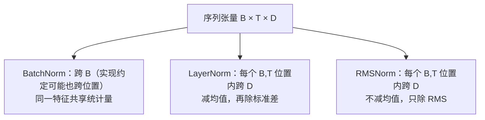

# 归一化

!!! info "参考资料"
    - Sergey Ioffe, Christian Szegedy, [Batch Normalization](https://arxiv.org/abs/1502.03167), ICML 2015
    - Jimmy Lei Ba, Jamie Ryan Kiros, Geoffrey E. Hinton, [Layer Normalization](https://arxiv.org/abs/1607.06450), 2016
    - Biao Zhang, Rico Sennrich, [Root Mean Square Layer Normalization](https://arxiv.org/abs/1910.07467), NeurIPS 2019
    - Shibani Santurkar et al., [How Does Batch Normalization Help Optimization?](https://papers.neurips.cc/paper_files/paper/2018/hash/905056c1ac1dad141560467e0a99e1cf-Abstract.html), NeurIPS 2018

## 直觉 (Intuition)

一层收到的数值若尺度忽大忽小，后面的参数就要同时适应内容和尺度。归一化先按指定轴计算统计量，把激活拉回较稳定的范围，再用可学习的缩放与平移恢复网络需要的表示能力。真正决定方法差异的不是公式长相，而是两个问题：**对哪些轴求统计量，训练和推理是否使用同一套统计量。**

归一化改变中间激活与优化几何；[正则化](./regularization.md)则主要约束模型学到的解。BatchNorm 的 batch 噪声可能附带正则化效果，但不能据此把两者当成同一种机制。

## 一条通用公式

对某个归一化集合 $S$，均值和方差为

$$
\mu_S=\frac1{|S|}\sum_{i\in S}x_i,
\qquad
\sigma_S^2=\frac1{|S|}\sum_{i\in S}(x_i-\mu_S)^2.
$$

标准化并恢复可学习仿射变换：

$$
\hat x_i=\frac{x_i-\mu_S}{\sqrt{\sigma_S^2+\epsilon}},
\qquad
y_i=\gamma_i\hat x_i+\beta_i.
$$

$\epsilon$ 防止方差很小时除零。$\gamma,\beta$ 让层能够学习“单位方差、零均值并非这里最合适”；因此归一化不是永久把每个输出锁死成标准正态。

## 用形状看归一化轴

卷积特征写成 $[N,C,H,W]$，序列特征写成 $[B,T,D]$。下表中的“归一化轴”表示计算一组均值/方差时被汇总的维度。

| 方法 | 典型输入 | 归一化轴 | 每组统计量属于谁 | train / eval | 常见位置 |
|---|---|---|---|---|---|
| BatchNorm2d | $[N,C,H,W]$ | $N,H,W$，保留 $C$ | 每个通道一组 | 不同；训练用 batch，推理用运行统计 | CNN |
| LayerNorm | $[B,T,D]$ | 通常为 $D$，保留 $B,T$ | 每个样本、每个 token 一组 | 相同 | Transformer、RNN、MLP |
| RMSNorm | $[B,T,D]$ | 通常为 $D$，保留 $B,T$ | 每个样本、每个 token 一组 | 相同 | 现代 Transformer |

再用一个小形状确认区别。若 $x$ 为 `[8, 16, 32, 32]`：

- BatchNorm2d 对每个通道汇总 $8\times32\times32$ 个数，得到 16 组统计量；
- 若把每个样本的 `[16, 32, 32]` 整体做 LayerNorm，则每个样本汇总 $16\times32\times32$ 个数，得到 8 组统计量；
- 两者输出形状都不变，但一个样本是否影响另一个样本完全不同。

## BatchNorm：统计量依赖 mini-batch

对全连接张量 $[N,C]$，BatchNorm 通常按每个特征 $c$ 汇总 batch 轴：

$$
\mu_c=\frac1N\sum_{n=1}^{N}x_{n,c},
\qquad
\sigma_c^2=\frac1N\sum_{n=1}^{N}(x_{n,c}-\mu_c)^2.
$$

卷积版本还会汇总空间位置。训练时当前 batch 的均值和方差参与输出，同时维护运行均值、运行方差；推理时使用运行统计，因此单个样本不必依赖同批的其他样本。

这带来三个直接后果：

- micro-batch 太小时，统计量噪声大，训练结果对 batch 组成敏感；
- 梯度累积不会把多个 micro-batch 的 BatchNorm 统计自动合并成大 batch；
- 忘记 `eval()` 会让部署输出继续依赖当前 batch，并更新不该变化的统计量。

原论文用“减少 internal covariate shift”解释 BatchNorm。后续研究对这是否是主要原因提出了实验证据上的质疑，并从损失与梯度更平滑等角度解释其优化收益。因此稳妥的说法是：BatchNorm 的确重标定激活，常能允许更稳定或更快的优化；其效果不应归结为一个已经完全定论的单一机制。

## LayerNorm：每个样本自己计算

对一个 token 的隐藏向量 $\mathbf x\in\mathbb R^D$，LayerNorm 在 $D$ 个特征内计算均值与方差：

$$
\operatorname{LN}(\mathbf x)
=\boldsymbol\gamma\odot
\frac{\mathbf x-\mu}{\sqrt{\sigma^2+\epsilon}}
+\boldsymbol\beta.
$$

不同样本、不同 token 互不借用统计量，因此 batch size 为 1 也能正常工作，训练与推理计算一致，也不需要运行均值。Transformer 常在每个 token 的隐藏维上做 LayerNorm；具体是残差前还是残差后属于架构设计，将在后续架构章节展开。

`nn.LayerNorm(normalized_shape)` 默认归一化输入末尾与 `normalized_shape` 对应的若干维。传 `[D]` 与 `[T,D]` 会改变统计轴，不能只凭层名判断。

## RMSNorm：保留尺度归一化，去掉中心化

RMSNorm 对同一个 $D$ 维向量计算

$$
\operatorname{RMS}(\mathbf x)
=\sqrt{\frac1D\sum_{i=1}^{D}x_i^2+\epsilon},
$$

$$
\operatorname{RMSNorm}(\mathbf x)
=\boldsymbol\gamma\odot\frac{\mathbf x}{\operatorname{RMS}(\mathbf x)}.
$$

它不减去均值，因此不提供重新中心化不变性，计算也少一步均值与中心化。原始 RMSNorm 只有可学习缩放；某些库额外提供 bias，要按实现核对。和 LayerNorm 一样，它的统计量来自当前样本的特征维，训练与推理行为相同，不依赖 batch 大小。

## 选择时先问数据轴

- CNN 且每卡 batch 足够大时，BatchNorm 是成熟选择；极小 batch 或样本间不能共享统计时，要谨慎。
- 序列长度变化、在线推理或 Transformer 中，LayerNorm/RMSNorm 不依赖同批样本，更自然。
- RMSNorm 少了中心化，常用于追求简洁和效率的现代 Transformer；它不是对所有任务都严格优于 LayerNorm。
- 归一化能缓和尺度问题，却不能替代合适的[初始化](./initialization.md)、学习率或残差设计。

!!! tip "面试 / 工程重点"
    最有效的回答不是背“CNN 用 BN、Transformer 用 LN”，而是标出轴：BN 跨 batch（卷积时也跨空间）为每个通道统计；LN/RMSNorm 在单个样本或 token 的特征维统计。由此立即得到 batch-size 敏感性与 train/eval 差异。

若归一化后训练仍不稳定，应把层级激活、梯度和运行统计作为证据，再到[训练故障诊断](../06-evaluation-debugging/diagnosing-training.md)按症状排查，而不是继续堆叠归一化层。
