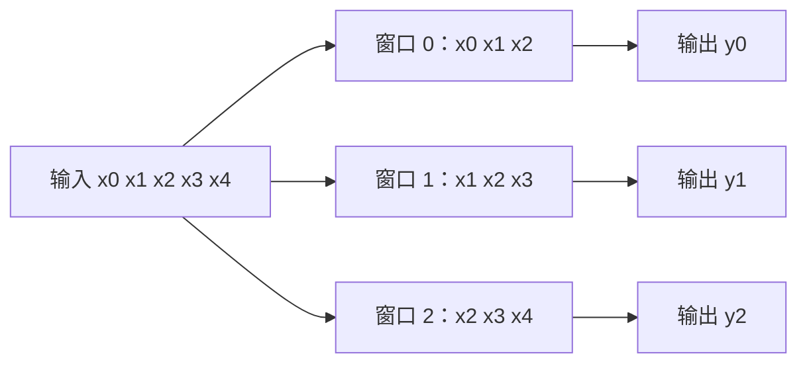

# 卷积

!!! info "参考资料"
    - Vincent Dumoulin, Francesco Visin, [A guide to convolution arithmetic for deep learning](https://arxiv.org/abs/1603.07285), 2018
    - [Conv2d](https://docs.pytorch.org/docs/stable/generated/torch.nn.Conv2d.html) — PyTorch Documentation；核形状、`groups` 与输出尺寸约定

## 直觉 (Intuition)

一张 $32\times32$ 图像里，同一种竖直边缘可能出现在左上角，也可能出现在右下角。若每个位置都学习一套互不相干的权重，模型既浪费参数，也必须分别见过每个位置。卷积只看一个局部窗口，并把同一组权重滑到所有位置：在一个位置学会的检测器可以在别处复用。

先看一维的 $3$ 点窗口。窗口每右移一步，就产生一个输出；相邻输出会共享大部分输入，因此堆叠后能逐渐扩大感受野。



图中的三个窗口使用的是**同一组核参数**，不是三个独立线性层。二维卷积只是把窗口扩展到高、宽和输入通道。

## 从局部乘加到输出形状

输入记为 $X\in\mathbb R^{B\times C_{in}\times H\times W}$。先忽略分组，一个输出元素可以写成

$$
Y_{b,c_o,i,j}=b_{c_o}
+\sum_{c_i=0}^{C_{in}-1}\sum_{u=0}^{K_h-1}\sum_{v=0}^{K_w-1}
W_{c_o,c_i,u,v}
X_{b,c_i,\,is_h-p_h+ud_h,\,js_w-p_w+vd_w}.
$$

$s$ 是 stride，决定窗口每次移动几格；$p$ 是两侧 padding；$d$ 是 dilation，决定核内相邻采样点的间隔。落在填充区的输入按所选 padding 规则处理，常见的零填充把它视为 0。

严格数学卷积会把核在空间轴上翻转。PyTorch 等深度学习库的 `Conv2d` 实际计算互相关 (cross-correlation)，不翻转核；因为核本来就是学习出来的，这不会减少表示能力，但阅读信号处理公式时要分清术语。

膨胀后的有效核尺寸为

$$
K_{\text{eff}}=d(K-1)+1.
$$

因此高这一轴的输出长度是

$$
H_{out}
=\left\lfloor
\frac{H+2p_h-d_h(K_h-1)-1}{s_h}
\right\rfloor+1,
$$

宽度同理。这个式子就是“填充后的可用长度减去有效核，再按步长数合法起点”。例如 $H=32,K_h=3,p_h=1,s_h=2,d_h=1$，得到 $H_{out}=16$。当分子不能整除 stride 时，末端放不下完整窗口的位置会被舍去；不要凭 `same` 这个名字猜不同框架在偶数核和 stride 大于 1 时的具体填充。

| 旋钮 | 改变了什么 | 设大后的直接后果 |
|---|---|---|
| stride $s$ | 窗口起点的间隔 | 输出更小、计算更少，但跳过更多位置 |
| padding $p$ | 边界外补多少位置 | 能保留边缘和尺寸，也会引入边界假设 |
| dilation $d$ | 核内采样点间隔 | 不增加核参数就扩大感受野，但采样更稀疏 |
| kernel $K$ | 每次覆盖的局部范围 | 参数与乘加次数随核面积增加 |

## 通道、分组与参数共享

普通卷积的每个输出通道都读取全部输入通道。若分成 $g$ 组，输入和输出通道也各分成 $g$ 组，组间不相连。权重形状变为

$$
W:\left[C_{out},\frac{C_{in}}{g},K_h,K_w\right],
$$

且 $C_{in}$、$C_{out}$ 都必须能被 $g$ 整除。含偏置时参数量为

$$
C_{out}\frac{C_{in}}{g}K_hK_w+C_{out}.
$$

参数量与 $H,W$ 无关，这正是跨位置共享。$g=1$ 是普通卷积；$g=C_{in}$ 且每个输入通道独立处理时得到 depthwise 情形。分组减小计算和跨通道连接，也可能让不同组的信息隔离；是否再做通道混合属于后续架构设计。

```python
import torch
from torch import nn

x = torch.randn(8, 16, 32, 32)
conv = nn.Conv2d(16, 32, kernel_size=3, stride=2, padding=1, groups=4)
y = conv(x)

print(conv.weight.shape)  # torch.Size([32, 4, 3, 3])
print(y.shape)            # torch.Size([8, 32, 16, 16])
```

## 归纳偏置、感受野与代价

卷积写入两个主要偏置：局部性假设邻近元素更容易直接相关；参数共享假设同一种局部模式可在不同位置出现。忽略边界并取 stride 1 时，输入平移会让特征图相应平移，这叫平移等变 (equivariance)，不是“输出天然不随平移变化”的平移不变。padding、stride 和后续聚合都会改变这项性质。

单层只看到 $K_{eff,h}\times K_{eff,w}$ 的局部范围。多层堆叠后，一个深层输出能依赖更大的输入区域，称为感受野；具体扩大多少还取决于之前各层的 stride 与 dilation。这里说明单个操作，完整的层级组合放在 [CNN 与 ResNet](../05-architectures/cnn-and-resnet.md)。

一次二维卷积的乘加次数可粗略写成

$$
O\!\left(
B H_{out}W_{out}C_{out}\frac{C_{in}}{g}K_hK_w
\right).
$$

训练还要保存输入、输出等激活；输出本身占 $O(B C_{out}H_{out}W_{out})$。因此把 stride 从 1 改为 2 虽然不改参数量，却会显著减少输出激活和后续计算。

## 常见失败方式

- 输出尺寸算错：尤其是 dilation、偶数核或 stride 不能整除时。把每个轴代入公式，再用一个小张量核对。
- 过早下采样：stride 过大可能让窄线条、小目标等高频信息在进入后续层前就消失；必要时先低通或保留更高分辨率。
- 边界伪影：大量零填充让边缘窗口看到与内部不同的分布，模型可能学到“黑边”而非真实结构。
- 分组过多：成本降低了，但跨组信息不足；这不是增加深度就必然能补回的连接。
- dilation 过大：感受野扩大，但规则空洞采样可能漏掉细小模式，出现网格效应。

!!! tip "面试 / 工程重点"
    参数共享减少的是“不同空间位置各自学习一套核”的冗余；它没有让不同输出通道共享同一套核。回答参数量时先写权重形状，再决定是否包含 bias。

卷积核怎样与下采样、归一化、残差连接和任务头组成完整视觉网络，见 [CNN 与 ResNet](../05-architectures/cnn-and-resnet.md)。
