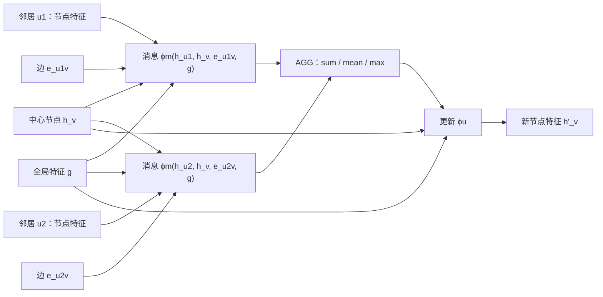

# 图消息传递

!!! info "参考资料"
    - Justin Gilmer et al., [Neural Message Passing for Quantum Chemistry](https://proceedings.mlr.press/v70/gilmer17a.html), ICML 2017
    - Manzil Zaheer et al., [Deep Sets](https://papers.nips.cc/paper/6931-deep-sets), NeurIPS 2017；集合函数的置换不变性
    - Peter W. Battaglia et al., [Relational inductive biases, deep learning, and graph networks](https://arxiv.org/abs/1806.01261), 2018

## 直觉 (Intuition)

要判断社交网络中一个账号的行为，只看它自己的属性可能不够，还要看它与哪些账号相连、边代表关注还是转发。图消息传递让每个节点从邻居收集信息，再更新自己的表示。把节点 7 改名为节点 2 不应改变结果；编号只是存储顺序，不是语义。

一张带属性图可以有三类信息：

- 节点特征 $\mathbf h_v$：账号、原子或路口自身的属性；
- 边特征 $\mathbf e_{uv}$：关系类型、键长或道路距离；
- 全局特征 $\mathbf g$：整张图共享的温度、场景条件或实验设置。

边决定谁能直接交换消息。没有边特征时可省略 $\mathbf e_{uv}$，没有全局条件时也可省略 $\mathbf g$，但三者的角色不要混淆。

## 一轮消息怎样流动

对指向节点 $v$ 的边 $(u,v)$，一条通用写法是

$$
\mathbf m_{uv}^{(\ell)}
=\phi_m^{(\ell)}\!\left(
\mathbf h_u^{(\ell)},
\mathbf h_v^{(\ell)},
\mathbf e_{uv}^{(\ell)},
\mathbf g^{(\ell)}
\right),
$$

$$
\bar{\mathbf m}_v^{(\ell)}
=\operatorname{AGG}_{u\in\mathcal N(v)}
\mathbf m_{uv}^{(\ell)},
\qquad
\mathbf h_v^{(\ell+1)}
=\phi_u^{(\ell)}\!\left(
\mathbf h_v^{(\ell)},\bar{\mathbf m}_v^{(\ell)},\mathbf g^{(\ell)}
\right).
$$

$\phi_m$ 生成边上传递的消息，`AGG` 把数量不定的邻居压成固定宽度，$\phi_u$ 更新中心节点。边自身也可由相邻节点与旧边特征更新；全局状态可从所有节点、边做置换不变汇总后更新。这里不固定这些函数的网络结构，命名架构与读出方式留给[图神经网络](../05-architectures/graph-neural-networks.md)。

## 用形状检查一次稀疏实现

设图有 $N$ 个节点、$M$ 条有向边：

| 阶段 | 张量形状 | 发生什么 |
|---|---|---|
| 节点输入 $H$ | $[N,d_h]$ | 每个节点一行 |
| 边输入 $E$ | $[M,d_e]$ | 每条边一行，与起终点索引对齐 |
| 逐边消息 | $[M,d_m]$ | 读取源节点、目标节点、边和可选全局特征 |
| 按目标节点聚合 | $[N,d_m]$ | 同一目标的消息做 sum/mean/max |
| 节点输出 $H'$ | $[N,d'_h]$ | 旧节点状态与聚合消息共同更新 |

一层后，节点只得到一跳邻居的信息；堆 $k$ 层才可能让 $k$ 跳范围内的信息影响它。是否真的保留这些信息还取决于聚合和更新函数，不能把“计算图上可达”当作“必然学会”。

## 为什么聚合必须与邻居顺序无关

邻域 $\mathcal N(v)$ 是集合。若存储时把两条入边交换顺序，节点输出不应改变。因此 `AGG` 应满足

$$
\operatorname{AGG}(\mathbf m_1,\ldots,\mathbf m_k)
=\operatorname{AGG}(\mathbf m_{\pi(1)},\ldots,\mathbf m_{\pi(k)})
$$

对任意排列 $\pi$ 都成立。sum、mean、max 都满足；直接按读取顺序把消息拼接后送进普通 MLP 通常不满足。

需要区分两个层次：重新编号节点时，每个节点的新表示应跟着同样重排，这是**置换等变**；把所有节点汇成一个图级预测时，读出结果不随编号改变，这是**置换不变**。局部聚合不变是得到节点级等变性的关键条件之一。

不同聚合也写入不同偏置。sum 保留数量信息，但高 degree 节点的幅值可能更大；mean 缓和 degree 尺度，却可能无法区分“一个相同邻居”和“十个相同邻居”；max 只保留每维最强信号，其他消息没有直接贡献。没有一种聚合在所有任务上都占优。

## 计算成本与局部关系偏置

共享的 $\phi_m$ 沿每条边执行，共享的 $\phi_u$ 沿每个节点执行。稀疏图的一轮成本可写成

$$
O\!\left(MC_m+NC_u\right),
$$

其中 $C_m$ 包含一次消息函数的计算以及把 $d_m$ 维消息累加到目标节点的逐边成本（至少为 $O(d_m)$），$C_u$ 是一次节点更新的成本。若实现把聚合单独计算，则应把时间写成 $O(MC_m+Md_m+NC_u)$，而不是遗漏该项。显式保存逐边消息约需 $O(Md_m)$，节点状态约需 $O(Nd_h)$。若把稀疏图转成 $N\times N$ 稠密邻接矩阵，时间或内存可能退化到 $O(N^2)$，即使真实边数远小于 $N^2$。

它的[归纳偏置](../02-neural-network-foundations/inductive-bias.md)是：关系由边定义，同一局部关系规则可在整张图复用，节点编号没有意义。这很适合结构确实由已知边表达的任务；若关键关系没有出现在图中，消息传递不会凭空建立那条通道。

## 常见失败方式

- **聚合依赖边存储顺序**：打乱边列表后预测改变，通常意味着实现把集合误当序列。
- **漏掉方向或边属性**：把 $(u,v)$ 与 $(v,u)$ 默认视为同一关系，可能丢失有向语义；无向图也要明确是否存成双向边。
- **孤立节点无合法消息**：空邻域的 sum 可定义为零，但更新函数仍应保留节点自身信息，否则输出会退化成常量。
- **degree 尺度失控**：sum 在高度节点上幅值变大；mean 又可能抹去邻居数量。先观察按 degree 分组的激活，再选择归一化或聚合。
- **图建错比网络更致命**：缺边、重复边、跨样本连边或数据泄漏都会改变计算本身，不能靠更深的消息函数修复。

多层堆叠还可能让节点表示过度相似，但这涉及深度、残差、归一化和读出共同作用；分析留在后续[图神经网络](../05-architectures/graph-neural-networks.md)，本页不把它归咎于单次聚合。

!!! tip "面试 / 工程重点"
    邻域聚合对消息顺序不变，得到的是节点输出随节点重编号一起重排的等变性；只有图级 readout 再对所有节点做不变聚合，整图预测才是置换不变。

调试图模型时，一个很有效的小测试是随机置换节点编号和边列表顺序，再把输出逆置换回来比较；节点级结果应一致到浮点误差范围。
