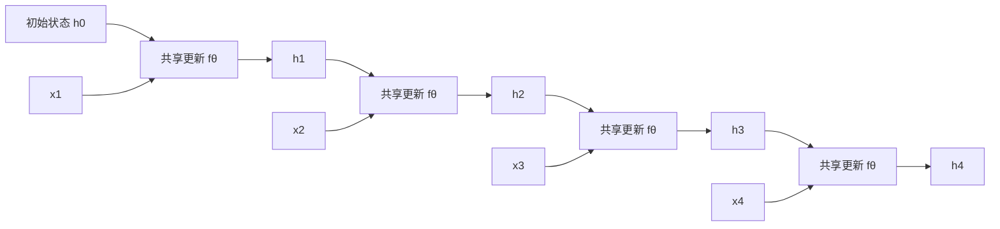

# 循环状态

!!! info "参考资料"
    - Razvan Pascanu, Tomas Mikolov, Yoshua Bengio, [On the difficulty of training Recurrent Neural Networks](https://arxiv.org/abs/1211.5063), ICML 2013
    - Ian Goodfellow, Yoshua Bengio, Aaron Courville, [Deep Learning, Chapter 10: Sequence Modeling](https://www.deeplearningbook.org/contents/rnn.html)

## 直觉 (Intuition)

逐字读取“今天不下雨”时，看到“雨”之前的“不”不能丢。循环状态用一个固定宽度向量携带已读历史：当前输入和上一时刻状态共同产生新状态，然后同一条更新规则继续处理下一个位置。

对最简单的循环单元，输入 $\mathbf x_t\in\mathbb R^{D_x}$、隐藏状态 $\mathbf h_t\in\mathbb R^{D_h}$：

$$
\mathbf a_t=W_{xh}\mathbf x_t+W_{hh}\mathbf h_{t-1}+\mathbf b_h,
\qquad
\mathbf h_t=\phi(\mathbf a_t).
$$

若每个时刻都需要输出，可再写

$$
\mathbf o_t=W_{ho}\mathbf h_t+\mathbf b_o.
$$

关键不是激活函数的名字，而是 $W_{xh}$、$W_{hh}$ 在所有时刻共享。序列变长时参数量不会随 $T$ 增加。

## 展开后还是同一组参数



图上画了四个更新节点，只是为了展示依赖；它们的参数全是同一个 $\theta$。因此反向传播时，各时刻对共享参数的梯度会相加。

批量输入常写成 $X\in\mathbb R^{B\times T\times D_x}$。在第 $t$ 步，取 $X[:,t,:]$ 得到 $[B,D_x]$，状态保持为 $[B,D_h]$。若保存全部时刻，输出状态序列是 $[B,T,D_h]$；若只保留最终状态，接口输出可为 $[B,D_h]$，但训练反向传播仍可能需要中间状态。

| 量 | 形状 |
|---|---|
| $X$ | $[B,T,D_x]$ |
| $W_{xh}$ | $[D_h,D_x]$ |
| $W_{hh}$ | $[D_h,D_h]$ |
| 每步 $\mathbf h_t$ | $[B,D_h]$ |
| 全部状态 $H$ | $[B,T,D_h]$ |

```python
import torch

B, T, D_x, D_h = 2, 5, 3, 4
x = torch.randn(B, T, D_x)
w_xh = torch.randn(D_h, D_x)
w_hh = torch.randn(D_h, D_h)
b = torch.zeros(D_h)

h = torch.zeros(B, D_h)
states = []
for t in range(T):
    h = torch.tanh(x[:, t] @ w_xh.T + h @ w_hh.T + b)
    states.append(h)

all_h = torch.stack(states, dim=1)
print(all_h.shape)  # torch.Size([2, 5, 4])
```

## 长依赖为什么难

从时刻 $t$ 到更晚的 $T$，梯度要连续穿过状态更新。对上式有

$$
\frac{\partial\mathbf h_t}{\partial\mathbf h_{t-1}}
=D_t W_{hh},
\qquad
D_t=\operatorname{diag}\!\left(\phi'(\mathbf a_t)\right).
$$

因此一段状态链的雅可比为

$$
\frac{\partial\mathbf h_T}{\partial\mathbf h_t}
=D_TW_{hh}D_{T-1}W_{hh}\cdots D_{t+1}W_{hh}.
$$

这是许多矩阵的乘积。其主导方向的尺度若长期小于 1，早期信号和梯度会指数式衰减；若长期大于 1，则可能爆炸。tanh 进入饱和区时 $\phi'$ 很小，会进一步加剧衰减。梯度裁剪能限制爆炸更新，却不能把已经衰减到近零的长期信息找回来。

门控怎样改变状态路径，以及 LSTM、GRU 的状态有何区别，放在 [RNN、LSTM 与 GRU](../05-architectures/rnn-lstm-gru.md)。这一页只保留循环更新本身的困难。

## 归纳偏置与成本

共享状态更新带来时间平移上的参数共享：相同局部模式无论出现在第几步，都由同一规则处理。单向 recurrence 还带有因果顺序，$\mathbf h_t$ 只依赖 $\mathbf x_{1:t}$。代价是所有历史被压进 $D_h$ 维状态，这是一种信息瓶颈；反向依赖也必须沿时间链传播。

若矩阵乘法为稠密实现，一步成本约为

$$
O\!\left(B(D_xD_h+D_h^2)\right),
$$

长度 $T$ 的总计算再乘 $T$。不同 batch 和特征维可以并行，但同一序列内必须先算 $\mathbf h_{t-1}$ 才能算 $\mathbf h_t$，所以顺序深度为 $O(T)$。训练保存全部状态约需 $O(BTD_h)$ 激活内存；流式推理若只向前走，可以只保留当前 $O(BD_h)$ 状态。

## 常见失败方式

- **忘记重置状态**：把上一条无关序列的最终状态传给下一条，等于制造了数据中不存在的连接。
- **padding 继续更新状态**：不同长度序列补齐后，若不按真实长度停止或遮蔽，补齐符号会污染最终状态。
- **长链梯度衰减或爆炸**：看总梯度范数还不够，应按时间跨度或层记录；裁剪只处理爆炸的一侧。
- **隐藏维过窄**：固定状态无法保留任务所需历史；盲目增大 $D_h$ 又会让 $D_h^2$ 计算、参数和状态成本快速增长。
- **误判并行性**：训练时可以并行 batch，不能把同一序列所有时间步当作彼此独立的线性层同时算完。

!!! tip "面试 / 工程重点"
    RNN 参数量不随序列长度增长，但计算时间随 $T$ 线性增长，而且同一序列的时间步存在串行依赖。把“参数共享”和“计算免费”混在一起是常见错误。

如果任务允许每个位置直接读取其他位置，可以继续看[注意力](./attention.md)；它缩短了位置间路径，但会付出成对分数矩阵的代价。
