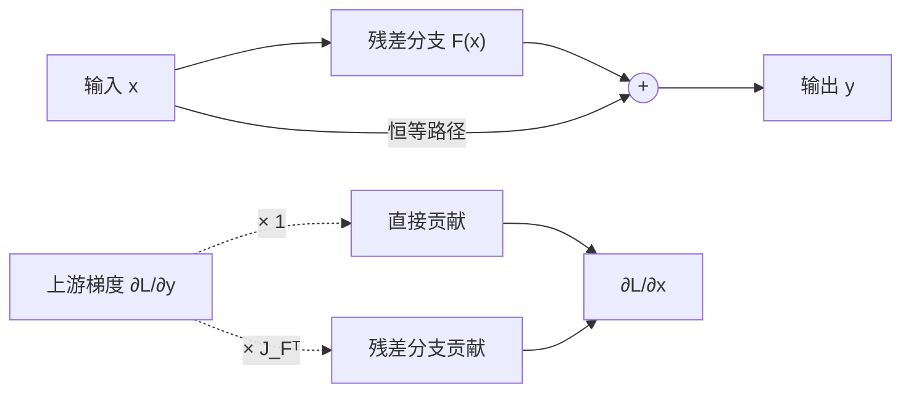

# 残差连接

!!! info "参考资料"
    - Kaiming He et al., [Deep Residual Learning for Image Recognition](https://openaccess.thecvf.com/content_cvpr_2016/html/He_Deep_Residual_Learning_CVPR_2016_paper.html), CVPR 2016

## 直觉 (Intuition)

假设一组变换收到向量 $\mathbf x$，眼下最好的动作其实是“先别改它”。普通堆叠必须用若干带参数层主动拟合恒等映射；残差连接直接提供一条恒等路径，只让另一条分支学习需要改动的部分。

最基本的操作是

$$
\mathbf y=\mathbf x+F(\mathbf x;\theta).
$$

若最合适的映射接近恒等映射，残差分支只需让 $F(\mathbf x)$ 接近零，再逐步学出修正。这里的结论是“重参数化常让优化更容易”，不是“层数增加后性能一定提高”。

## 两条前向路径，两份反向贡献



前向时，加法要求两条路径形状完全相同。若

$$
\mathbf x, F(\mathbf x)\in\mathbb R^{B\times T\times D},
$$

则 $\mathbf y$ 仍是 $[B,T,D]$；图像张量 $[B,C,H,W]$ 也同理。逐元素相加不会像拼接那样把特征维翻倍。

对损失 $L$ 求导，列梯度约定下有

$$
\nabla_{\mathbf x}L
=\left(I+J_F(\mathbf x)\right)^\top\nabla_{\mathbf y}L
=\nabla_{\mathbf y}L+J_F(\mathbf x)^\top\nabla_{\mathbf y}L.
$$

第一项来自恒等路径，不需要连续穿过残差分支里的每个局部雅可比；第二项仍让 $F$ 获得训练信号。这与[反向传播](../03-training/backpropagation.md)中分支贡献相加是同一条链式法则。

“有直接项”不等于梯度绝不会消失或爆炸。两项可能部分抵消，$J_F$ 可能很大，多次残差相加也会改变激活尺度。残差连接改善了路径结构，但仍要配合合适的[初始化](../03-training/initialization.md)、[归一化](../03-training/normalization.md)与学习率。

## 形状不同时怎么办

恒等 shortcut 没有参数，计算与内存开销几乎只是一次同形状加法。若通道数、空间尺寸或特征维改变，$\mathbf x$ 不能直接与 $F(\mathbf x)$ 相加。可引入投影 $P$：

$$
\mathbf y=P(\mathbf x)+F(\mathbf x).
$$

例如 $P$ 可以是线性映射，或改变通道和 stride 的 $1\times1$ 卷积。它让形状对齐，却不再是严格恒等路径，也增加参数和计算。选择在哪里改变尺寸、投影放在哪些块里，已经属于 [CNN 与 ResNet](../05-architectures/cnn-and-resnet.md)或 [Transformer](../05-architectures/transformer.md)的整体设计。

```python
import torch
from torch import nn

class ResidualTransform(nn.Module):
    def __init__(self, width: int):
        super().__init__()
        self.transform = nn.Sequential(
            nn.Linear(width, width),
            nn.ReLU(),
            nn.Linear(width, width),
        )

    def forward(self, x):
        return x + self.transform(x)  # 相加要求末维 width 不变

x = torch.randn(4, 12, 64)
y = ResidualTransform(64)(x)
print(y.shape)  # torch.Size([4, 12, 64])
```

## 它写入了什么偏好，花费多少

残差形式偏爱“保留已有表示，再学习增量修正”。它不会指定 $F$ 必须是卷积、注意力还是 MLP，因此是跨架构复用的连接方式。

若 $F$ 的成本记为 $C_F$，恒等 shortcut 的额外计算约为输出元素数 $O(|\mathbf y|)$，通常远小于 $C_F$；但训练时仍需保留分支所需激活。投影 shortcut 的代价取决于 $P$，不能再当作免费。残差也没有减少 $F$ 自身的参数量。

## 常见失败方式

- **形状悄悄不一致**：时间长度、空间尺寸或通道任一轴不同都不能逐元素相加；不要依赖意外广播。
- **残差分支尺度过大**：若 $F(\mathbf x)$ 远大于 $\mathbf x$，恒等路径在数值上几乎被淹没，深层相加还可能使激活逐层增长。
- **原地修改 shortcut**：对将被复用的 $\mathbf x$ 做不安全的 in-place 操作，可能破坏自动微分保存的值或让“恒等”路径不再恒等。
- **把投影当恒等映射**：投影能对齐形状，但它有参数、会改变信号，也可能成为新的优化瓶颈。
- **过度承诺梯度稳定**：观察到梯度异常时仍应按层记录激活和梯度；残差结构不是跳过[训练故障诊断](../06-evaluation-debugging/diagnosing-training.md)的理由。

!!! tip "面试 / 工程重点"
    残差连接的关键梯度式是 $I+J_F$，不是只有 $J_F$。这提供一条直接贡献，却不是梯度范数恒为 1 的证明；回答时把“路径更直接”和“绝对保证”分开。

归一化在相加前还是相加后、每个块里放几次变换，会影响完整模型的训练行为；这些组合选择留到架构页展开。
