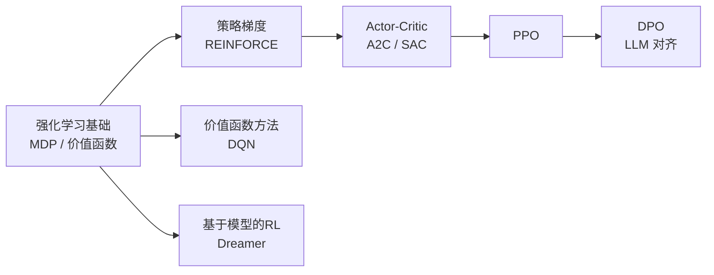

# 强化学习

让模型通过与环境交互学会做决策。这一章按 CS 285 的逻辑组织：从 MDP 基础出发，依次讲策略梯度、Actor-Critic、价值方法，再到工程上最常用的 PPO 和基于模型的 RL。

## 本章知识地图

## 你将学到

| 小节 | 核心内容 | 前置依赖 |
|------|----------|----------|
| [强化学习基础](rl-basics.md) | MDP、回报、策略、值函数、Bellman 方程 | 概率论 |
| [策略梯度](policy-gradient.md) | REINFORCE、Baseline、方差减小 | RL 基础 |
| [Actor-Critic](actor-critic.md) | 优势函数、A2C、SAC | 策略梯度 |
| [价值函数方法](value-methods.md) | Q-learning、DQN、经验回放 | RL 基础 |
| [PPO](ppo.md) | Clipped Objective、重要性采样 | Actor-Critic |
| [基于模型的 RL](model-based.md) | World Model、Dreamer、MBPO | PPO |
| [DPO](dpo.md) | 直接偏好优化、绕开奖励模型 | PPO |
