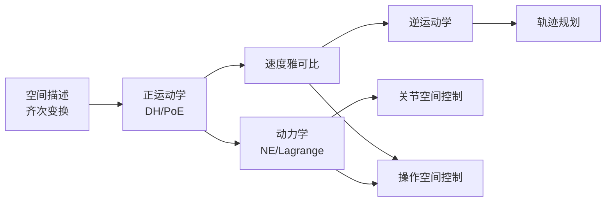

# 传统运动控制算法

在深度学习介入之前，机器人运动控制已经有一套成熟的数学体系。理解这套体系，是读懂现代具身智能论文（VLA、扩散策略、运动规划）的基础。

本章内容以 [Stanford CS223A](https://cs.stanford.edu/groups/manips/teaching/cs223a/)（Khatib 教授）和 [Northwestern Modern Robotics](http://hades.mech.northwestern.edu/index.php/Modern_Robotics)（Lynch & Park 教材）为主线。

## 你将学到

| 小节 | 核心内容 | 前置依赖 |
|------|----------|----------|
| [空间描述与齐次变换](spatial-descriptions.md) | 旋转矩阵、欧拉角、四元数、齐次变换矩阵 | SO(3)/SE(3) |
| [正运动学](forward-kinematics.md) | DH 参数法、指数积（PoE）公式 | 空间描述 |
| [速度雅可比](jacobian.md) | 线速度/角速度雅可比、奇异性分析 | 正运动学 |
| [逆运动学](inverse-kinematics.md) | 解析解、数值迭代法（Newton-Raphson） | 雅可比 |
| [轨迹规划](trajectory-generation.md) | 关节空间与笛卡尔空间插值、时间参数化 | 逆运动学 |
| [动力学](dynamics.md) | Newton-Euler 递推、拉格朗日方程、惯性矩阵 | 刚体力学基础 |
| [关节空间控制](joint-space-control.md) | PD 控制、计算力矩控制（CTC） | 动力学 |
| [操作空间控制](operational-space-control.md) | Khatib 操作空间方法、末端力控制 | 雅可比、动力学 |

## 本章知识地图

