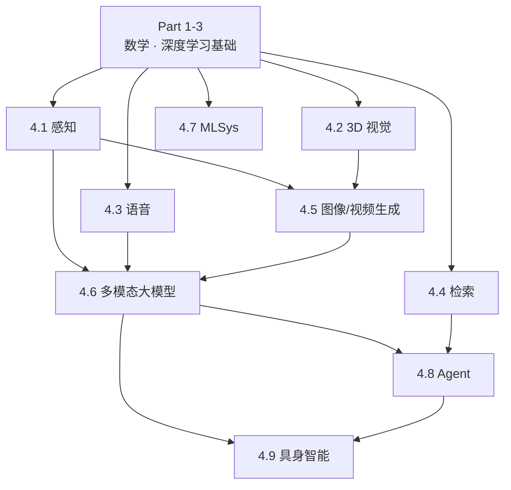

# Part 4 · 现代 AI 应用

前三部分打好了基础，这一部分看真实世界的应用。从感知到生成，从语音到机器人，从系统优化到科学计算。每章相对独立，可以按需阅读。

## 章节导图

## 各章概览

| 章节 | 核心问题 | 代表方向 |
|------|----------|----------|
| [4.1 感知](perception/index.md) | 图像里有什么？ | 分类、检测、分割、光流、OCR |
| [4.2 3D 视觉](3dv/index.md) | 世界的三维结构是什么？ | NeRF、3DGS、SLAM、生成 |
| [4.3 语音](audio/index.md) | 声音里有什么信息？ | ASR、TTS、增强 |
| [4.4 检索](retrieval/index.md) | 怎么快速找到相关信息？ | HNSW、RAG、Neural Ranking |
| [4.5 生成](generation/index.md) | 怎么生成逼真的图像/视频？ | SD、FLUX、DiT、视频生成 |
| [4.6 多模态大模型](multimodal/index.md) | 怎么让模型同时理解图和文？ | CLIP、VLM、LLM、对齐 |
| [4.7 MLSys](mlsys/index.md) | 怎么让模型跑得更快更省？ | 并行、量化、KV Cache |
| [4.8 Agent](agent/index.md) | 怎么让模型自主完成任务？ | ReAct、Planning、Memory |
| [4.9 具身智能](embodied/index.md) | 怎么让机器人行动？ | VLA、Sim2Real、World Model |
