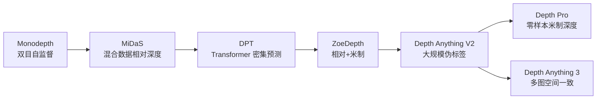

# 深度估计 (Depth Estimation)

!!! info "参考资料"
    **必读论文**

    - [Unsupervised Monocular Depth Estimation with Left-Right Consistency](https://openaccess.thecvf.com/content_cvpr_2017/html/Godard_Unsupervised_Monocular_Depth_CVPR_2017_paper.html) — Godard et al., CVPR 2017
    - [Towards Robust Monocular Depth Estimation](https://arxiv.org/abs/1907.01341) — Ranftl et al., TPAMI 2022
    - [Vision Transformers for Dense Prediction](https://openaccess.thecvf.com/content/ICCV2021/html/Ranftl_Vision_Transformers_for_Dense_Prediction_ICCV_2021_paper.html) — Ranftl et al., ICCV 2021
    - [ZoeDepth: Zero-shot Transfer by Combining Relative and Metric Depth](https://arxiv.org/abs/2302.12288) — Bhat et al., 2023
    - [Depth Anything V2](https://arxiv.org/abs/2406.09414) — Yang et al., NeurIPS 2024
    - [Depth Pro: Sharp Monocular Metric Depth in Less Than a Second](https://arxiv.org/abs/2410.02073) — Bochkovskii et al., 2024
    - [Depth Anything 3](https://arxiv.org/abs/2511.10647) — Wang et al., 2025

## 直觉 (Intuition)

深度估计要为图像中的每个像素预测它离相机多远。双目相机可以利用左右图像的视差恢复几何，单张图则必须借助透视、遮挡、物体大小和训练数据中的先验。最容易混淆的是相对深度与米制深度：知道 A 比 B 近，不等于知道 A 距离相机两米。现代基础模型提高了跨场景泛化，但尺度、相机参数和时间一致性仍决定它能否进入三维系统。

## 任务定义

深度图记为 $D(\mathbf{x})$，表示像素 $\mathbf{x}$ 对应的场景点沿相机视线方向的距离。常见设置有：

- 双目深度：输入校准后的左右图像，通过视差和基线恢复尺度
- 单目相对深度：输出远近顺序，允许整体尺度和平移不确定
- 单目米制深度：直接输出米等物理单位
- 多视图深度：联合多帧和相机位姿，要求跨视角一致

在平行双目模型中，深度与视差满足：

$$
Z=\frac{fB}{d}.
$$

其中 $Z$ 是深度，$f$ 是焦距，$B$ 是双目基线，$d$ 是左右图像中的视差。视差越小，物体越远；远处很小的视差误差会被放大成明显深度误差。

## 发展脉络

*深度估计主线：先解决没有稠密真值时如何训练，再解决跨数据集泛化、米制尺度和多视图一致性。来源：本文示意图。*

### 从双目几何到单目学习

双目深度有明确几何尺度，但依赖相机标定、同步和可靠匹配。纯单目图像没有唯一尺度：把一个小物体放近和一个大物体放远，可能产生相似投影。

Monodepth（[Paper](https://openaccess.thecvf.com/content_cvpr_2017/html/Godard_Unsupervised_Monocular_Depth_CVPR_2017_paper.html) | [Project](https://github.com/mrharicot/monodepth)）在训练时使用校准双目对，把预测深度转成视差并重建另一视图。模型无需每个像素的传感器深度真值，就能学习单图深度。

这种光度重建监督依赖静态场景、亮度一致和可见对应。动态物体、反光、遮挡和曝光变化会破坏假设，预测尺度也受训练相机分布影响。

### MiDaS：混合数据先解决相对深度泛化

不同深度数据集的尺度、偏移和传感器噪声不一致，直接混合会产生冲突。MiDaS 对应的工作（[Paper](https://arxiv.org/abs/1907.01341) | [Project](https://github.com/isl-org/MiDaS)）使用对尺度与平移不敏感的目标，把多个数据集统一到相对深度学习。

它改变了研究重点：先得到跨数据集稳定的几何排序，再考虑如何恢复绝对尺度。代价是输出不能直接当米制距离使用。

### DPT：全局上下文进入密集预测

卷积网络在局部细节上强，但单目深度需要利用房间布局、地平线和物体关系等全局线索。

Dense Prediction Transformer，简称 DPT（[Paper](https://openaccess.thecvf.com/content/ICCV2021/html/Ranftl_Vision_Transformers_for_Dense_Prediction_ICCV_2021_paper.html) | [Project](https://github.com/isl-org/MiDaS)），用 ViT 编码全局 token，再把不同阶段的表示重组为多尺度特征并逐步恢复分辨率。它成为 MiDaS 后续模型的重要架构，也说明 Transformer 表征可以用于逐像素回归。

### ZoeDepth：把相对泛化与米制预测接起来

相对深度模型跨场景稳，米制模型通常只在特定数据集准确。ZoeDepth（[Paper](https://arxiv.org/abs/2302.12288) | [Project](https://github.com/isl-org/ZoeDepth)）在通用相对深度骨干上增加米制深度头，用多个 metric bin 适配不同领域。

这条路线试图同时保留跨数据集结构和物理尺度。官方仓库现已停止维护，也提醒我们：论文效果、代码可维护性和长期工程可用性是三个不同问题。

### Depth Anything V2：数据规模和伪标签成为主角

高质量深度真值昂贵，尤其难覆盖互联网图像的多样性。Depth Anything V2（[Paper](https://arxiv.org/abs/2406.09414) | [Project](https://depth-anything-v2.github.io/)）使用强教师生成大规模真实图像伪标签，并用高质量合成数据改善细节。它把模型能力更多地归因于数据覆盖、教师质量和训练配方，而不是复杂的专用模块。

*Depth Anything V2 展示了通用单目深度模型在多场景中的相对深度效果。来源：[Depth Anything V2 官方项目页](https://depth-anything-v2.github.io/)*

模型输出的相对深度适合通用感知和下游条件输入，但不能因为视觉上平滑就视为准确米制测量。

### Depth Pro：强调零样本米制尺度与边界

Depth Pro（[Paper](https://arxiv.org/abs/2410.02073) | [Project](https://machinelearning.apple.com/research/depth-pro)）直接面向零样本米制单目深度，并强调高分辨率边界与焦距估计。它把评测注意力从平均深度误差拉回物体轮廓，因为三维重建、抠图和增强现实常在边界处最容易失败。

*Depth Pro 的示例强调边界锐度和单图米制深度预测。来源：[Apple Machine Learning Research](https://machinelearning.apple.com/research/depth-pro)*

### Depth Anything 3：从单图深度走向统一空间几何

Depth Anything 3（[Paper](https://arxiv.org/abs/2511.10647) | [Project](https://depth-anything-3.github.io/)）接收任意数量图像，可在相机位姿已知或未知时预测空间一致的几何。它用统一的 depth-ray 表示连接单图、双目和多视图输入。

*Depth Anything 3 把单图、双目和多图深度统一到空间一致的几何预测中。来源：[Depth Anything 3 官方项目页](https://depth-anything-3.github.io/)*

这代表一个新的方向：深度模型不再只输出每张图各自合理的二维深度图，还要保证不同视角能落到同一个三维空间中。跨视图漂移、动态物体和大场景内存因此成为更重要的问题。

## 核心方法

### 相对深度与尺度对齐

相对深度允许对预测做整体尺度和平移变换后再比较结构。米制深度要求数值本身有物理意义。论文或模型页面只写“depth”时，必须检查输出定义，不能从可视化颜色推断它有绝对尺度。

### 逆深度

很多模型预测逆深度 $\rho=1/Z$。近处深度变化在逆深度空间更明显，数值范围也更适合训练。使用输出时要确认模型给的是 depth、disparity 还是 inverse depth。

### 光度重建

自监督方法用预测深度和相机运动把一帧重投影到另一帧，并最小化重建误差。它把几何写进训练目标，却无法自动处理非刚体运动和不可见区域，需要遮挡掩码、最小重投影或运动模型辅助。

## 工程实践

### 相机参数不能含糊

双目和多视图系统必须记录内参、基线、畸变和图像裁剪。对输入 resize 或 crop 后，焦距和主点也要同步更新。否则模型输出看似平滑，投回三维后会整体变形。

### 无效深度要单独处理

LiDAR、结构光和双目算法都会产生缺失值。训练前要区分“没有真值”和“深度为零”，损失只在有效区域计算。评测时也要固定最大深度和裁剪范围。

!!! tip "工程重点"
    把单目相对深度送入机器人规划前，先明确怎样恢复尺度。用少量已知距离、相机高度或稀疏深度做尺度对齐，比直接把灰度值当米更可靠。

### 边界质量影响下游几何

前景与背景的深度泄漏会产生三维飞点。平均误差可能很好，物体轮廓却不可用。应检查边界指标、点云可视化和下游任务，而不是只看彩色深度图。

## 开放问题

以下判断基于截至 2026 年 6 月公开的论文与项目资料。

- **单目米制尺度仍依赖数据先验。** 新相机、特殊镜头、微观或超远距离场景可能超出训练分布。
- **视频深度容易闪烁。** 单帧模型逐帧预测时没有时间约束，边界和尺度会变化；加入时序后又要处理动态物体与漂移。
- **透明、反光和低纹理表面仍困难。** 这些区域同时破坏传感器真值、双目匹配和光度监督。
- **多视图一致性与动态场景冲突。** 静态几何假设无法覆盖人、车辆和可变形物体，需要联合估计运动、深度和相机位姿。
- **不确定性缺少统一接口。** 下游系统需要知道哪里不能信，但很多模型只输出单张深度图。
