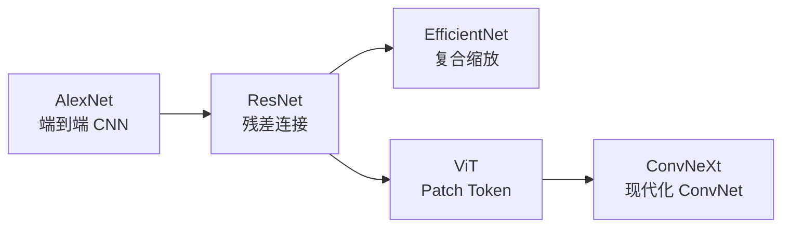
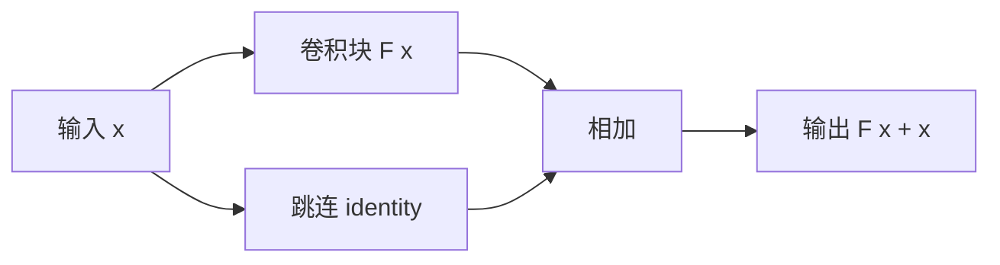

# 图像分类

!!! info "参考资料"
    **必读论文**

    - [ImageNet Classification with Deep Convolutional Neural Networks](https://papers.nips.cc/paper/4824-imagenet-classification-with-deep-convolutional-neural-networks) — Krizhevsky et al., NeurIPS 2012
    - [Deep Residual Learning for Image Recognition](https://openaccess.thecvf.com/content_cvpr_2016/html/He_Deep_Residual_Learning_CVPR_2016_paper.html) — He et al., CVPR 2016
    - [EfficientNet: Rethinking Model Scaling for Convolutional Neural Networks](https://proceedings.mlr.press/v97/tan19a.html) — Tan and Le, ICML 2019
    - [An Image Is Worth 16x16 Words](https://openreview.net/forum?id=YicbFdNTTy) — Dosovitskiy et al., ICLR 2021
    - [A ConvNet for the 2020s](https://openaccess.thecvf.com/content/CVPR2022/html/Liu_A_ConvNet_for_the_2020s_CVPR_2022_paper.html) — Liu et al., CVPR 2022

## 直觉 (Intuition)

图像分类要回答的是：一张图整体上最像哪个类别。输入是一张图，输出是每个候选类别的概率。难点不只是认出物体，还包括忽略背景、视角、光照和尺度变化。现代分类器的核心工作，是把像素压缩成一个保留语义、丢掉干扰的特征向量。这个向量也会成为检测、分割和多模态模型的视觉基础。

## 任务定义

设输入图像为 $\mathbf{x}$，类别集合有 $K$ 个类别。分类模型输出 logits $\mathbf{z}\in\mathbb{R}^{K}$，经过 softmax 得到类别概率：

$$
p(y=k\mid \mathbf{x})=\frac{\exp(z_k)}{\sum_{j=1}^{K}\exp(z_j)}.
$$

其中 $z_k$ 是第 $k$ 类的未归一化分数，$p(y=k\mid\mathbf{x})$ 是模型认为图像属于该类的概率。

常见评测是 Top-1 Accuracy，也就是分数最高的类别是否正确。ImageNet 还常用 Top-5 Accuracy，只要真实类别出现在前五个预测中就算正确。长尾数据、医学影像或安全系统不能只看准确率，还需要检查每类召回率、置信度校准和分布外样本。

!!! warning "分类不等于理解"
    模型答对“这是一辆校车”，不代表它理解车辆结构、道路规则或图中物体之间的关系。分类标签只监督最终答案，模型可能同时学到背景和拍摄习惯等捷径。

## 发展脉络

*图像分类主线：先解决“CNN 能不能在大数据上学出特征”，再解决深层优化、模型缩放和卷积/Transformer 归纳偏置的取舍。来源：本文示意图。*

### AlexNet：让大规模 CNN 真正可训练

2012 年以前，图像识别常依赖人工设计的 SIFT、HOG 等特征。研究者先决定“边缘和纹理应该怎样表示”，分类器只负责最后的决策。问题是人工特征很难覆盖真实图像中的复杂变化。

AlexNet（[Paper](https://papers.nips.cc/paper/4824-imagenet-classification-with-deep-convolutional-neural-networks)）把特征提取和分类放进同一个深层卷积网络，在大规模 ImageNet 数据上端到端训练。它的历史意义不在某个单独模块，而在于 GPU 训练、ReLU、数据增强、dropout 和大数据共同证明了一件事：视觉特征可以从任务数据中学出来。

代价也很明显。网络越深，优化越困难；模型规模和计算量增长后，架构设计开始受训练稳定性限制。

### ResNet：深度不再等于优化负担

直接堆叠卷积层会出现“退化问题”：更深的网络在训练集上反而更差，这不能只用过拟合解释。ResNet（[Paper](https://openaccess.thecvf.com/content_cvpr_2016/html/He_Deep_Residual_Learning_CVPR_2016_paper.html) | [Project](https://github.com/kaiminghe/deep-residual-networks)）让一个模块学习残差：

*ResNet 的基本块不是直接学习完整映射，而是学习对输入的修正量。来源：本文示意图。*

$$
\mathbf{y}=\mathcal{F}(\mathbf{x})+\mathbf{x}.
$$

其中 $\mathbf{x}$ 是模块输入，$\mathcal{F}$ 是卷积层要学习的修正量，$\mathbf{y}$ 是输出。如果额外的层暂时学不到有用变换，把 $\mathcal{F}(\mathbf{x})$ 推向零就能接近恒等映射。这个简单的旁路让梯度更容易穿过深层网络，也让 ResNet 成为后续检测、分割和姿态估计长期使用的骨干网络。

### EfficientNet：模型变大也要讲方法

有了稳定的深层网络后，下一道问题是怎样使用新增算力。只增加深度、通道数或输入分辨率，常常会让某一部分成为瓶颈。

EfficientNet（[Paper](https://proceedings.mlr.press/v97/tan19a.html) | [Project](https://github.com/tensorflow/tpu/tree/master/models/official/efficientnet)）提出复合缩放，同时调整深度、宽度和分辨率。它把“做一个更大的模型”变成受资源约束的设计问题，也提醒我们参数量、FLOPs 和真实延迟不是同一个指标。

!!! tip "工程重点"
    在目标设备上选模型时，直接测端到端延迟和峰值显存。深度可分离卷积的 FLOPs 很低，但某些硬件或推理框架未必能高效执行，纸面计算量可能无法换成实际速度。

### ViT：卷积不是唯一的视觉骨架

CNN 天然偏好局部连接和平移等变，这种归纳偏置在数据有限时很有价值。它也限制了架构：远距离区域要经过很多层才能交互。

Vision Transformer，简称 ViT（[Paper](https://openreview.net/forum?id=YicbFdNTTy) | [Project](https://github.com/google-research/vision_transformer)），把图像切成固定大小的 patch，并把 patch 当作 token 送入 Transformer。实验说明，当预训练数据和模型规模足够大时，较少依赖卷积先验的模型也能学到强视觉表征。

*ViT 把二维图像转成 token 序列，再复用 Transformer 的全局注意力。来源：本文示意图。*

ViT 没有证明 CNN 失效。它证明了数据规模、预训练和全局交互可以替代一部分手工写进网络的视觉先验。小数据训练、细粒度边界和高分辨率计算仍会让卷积或分层结构占据优势。

### ConvNeXt：真正改变结果的也可能是训练范式

ViT 成功后，一个自然问题是：优势来自 Transformer 本身，还是现代训练策略和尺度设计？

ConvNeXt（[Paper](https://openaccess.thecvf.com/content/CVPR2022/html/Liu_A_ConvNet_for_the_2020s_CVPR_2022_paper.html) | [Project](https://github.com/facebookresearch/ConvNeXt)）逐步把 ResNet 的卷积核、stage 比例、归一化和训练配置改造成接近现代 Transformer 的设计。结果表明，纯卷积网络仍能保持很强的分类和下游迁移能力。CNN 与 ViT 的边界因此变得模糊，研究重点转向表征质量、训练数据和计算效率。

## 核心方法

### 卷积偏置与全局注意力

卷积在所有空间位置共享同一组权重，擅长捕捉局部纹理，并能自然迁移到不同图像位置。自注意力根据当前图像动态计算 token 之间的关系，更容易建立远距离联系，但标准注意力的计算量会随 token 数量平方增长。

实际系统通常不必在两者中二选一。分层 ViT、混合网络和现代 ConvNet 都在交换局部性、全局上下文与硬件效率。

### 分类头与视觉表征

训练时的最后一层把特征映射到固定类别。迁移到新任务时，真正有价值的往往是分类头之前的特征。常见迁移方式有两种：

- 线性探测：冻结骨干，只训练一个新分类头，用来检查表征本身是否可分
- 微调：更新部分或全部网络，让表征适应新数据

小数据场景下，从可靠的预训练模型开始通常比从零训练稳定。若新任务与预训练数据差异很大，冻结太多层会保留错误的先验。

## 工程实践

### 数据问题通常先于模型问题

类别定义重叠、漏标和重复图片会直接限制分类上限。训练前至少检查：

- 每类样本数和采集来源
- 训练集与测试集是否出现近重复图
- 背景是否和标签形成不合理绑定
- 标签是否真的能从单张图中判断

长尾数据不能只依赖整体准确率。重采样和类别加权能提高尾部召回，但可能破坏概率校准，需要在业务代价下重新选阈值。

### 分辨率改变的不只是算力

提高输入分辨率有利于细粒度类别和小目标，但会增加显存、延迟和增强策略的敏感性。训练和部署的裁剪方式不一致时，模型可能在离线评测正常、线上构图变化后明显退化。

### 置信度不是正确概率

softmax 最大值很高，只说明模型在现有类别中偏向某一类。它不能保证输入属于训练分布。医疗、安全和质检系统应单独评估校准误差、拒识策略和分布外检测。

## 开放问题

以下判断基于截至 2026 年 6 月公开的论文与项目资料。

- **标签空间仍然封闭。** 固定类别分类器不能自然处理新概念。视觉语言模型缓解了开放词汇识别，但文本标签的歧义和视觉细粒度差异仍会造成错误。
- **数据捷径难以发现。** 模型可能依赖水印、背景或设备特征。平均准确率无法说明模型是否学到了可迁移的视觉证据。
- **鲁棒性与校准仍不足。** 图像压缩、天气、传感器变化和分布偏移都会改变置信度，部署前需要针对目标环境重新评测。
- **分类正在变成表征评测。** 研究不再只问 ImageNet 准确率多高，而是问同一表征能否支持检测、分割、检索和开放词汇任务。如何公平比较不同数据和算力下的表征，仍没有统一答案。
