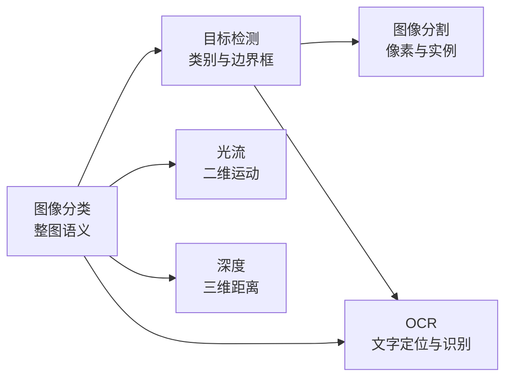

# 4.1 感知

感知模型把像素变成机器可以继续使用的语义与几何信息。本章从整图标签出发，逐步增加输出的空间精度：边界框回答物体在哪里，掩码回答每个像素属于什么，光流和深度则描述运动与三维结构。OCR 最后展示如何把检测、识别、版面和语义组合成完整系统。

## 你将学到

| 小节 | 核心内容 | 前置依赖 |
|------|----------|----------|
| [图像分类](image-classification.md) | 从 AlexNet、ResNet 到 ViT，理解视觉表征怎样形成 | [CNN](../../02-deep-learning/cnn.md)、[ViT](../../03-advanced/modern-architectures/vit.md) |
| [目标检测](object-detection.md) | 两阶段、单阶段、anchor-free 与 DETR 集合预测 | 图像分类、[Transformer](../../02-deep-learning/transformer.md) |
| [图像分割](segmentation.md) | 语义、实例、全景与提示分割，FCN 到 SAM 3 | 目标检测、[U-Net](../../03-advanced/modern-architectures/unet.md) |
| [光流估计](optical-flow.md) | 从经典能量优化到 RAFT 的相关体和迭代更新 | [CNN](../../02-deep-learning/cnn.md)、优化基础 |
| [深度估计](depth-estimation.md) | 双目几何、单目相对/米制深度与空间基础模型 | [相机模型](../3dv/camera-embedding.md)、[DPT](../../03-advanced/modern-architectures/dpt.md) |
| [OCR 与文档智能](ocr.md) | 文字检测识别、版面预训练与 OCR-free 文档理解 | 目标检测、[Transformer](../../02-deep-learning/transformer.md) |

## 建议阅读顺序

第一次系统学习时，先读图像分类，再读目标检测与图像分割。这三节建立“整图、物体、像素”三个输出层级。

光流和深度更依赖几何，可以独立阅读。OCR 与文档智能会同时用到检测、序列建模和多模态表示，放在最后更容易看清完整工程管线。

## 本章知识地图

