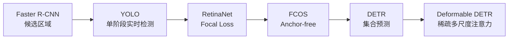
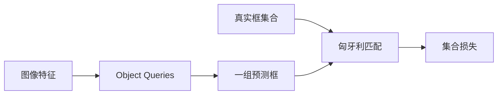

# 目标检测

!!! info "参考资料"
    **必读论文**

    - [Faster R-CNN: Towards Real-Time Object Detection with Region Proposal Networks](https://proceedings.neurips.cc/paper/2015/hash/14bfa6bb14875e45bba028a21ed38046-Abstract.html) — Ren et al., NeurIPS 2015
    - [You Only Look Once: Unified, Real-Time Object Detection](https://openaccess.thecvf.com/content_cvpr_2016/html/Redmon_You_Only_Look_CVPR_2016_paper.html) — Redmon et al., CVPR 2016
    - [Focal Loss for Dense Object Detection](https://openaccess.thecvf.com/content_iccv_2017/html/Lin_Focal_Loss_for_ICCV_2017_paper.html) — Lin et al., ICCV 2017
    - [FCOS: Fully Convolutional One-Stage Object Detection](https://openaccess.thecvf.com/content_ICCV_2019/html/Tian_FCOS_Fully_Convolutional_One-Stage_Object_Detection_ICCV_2019_paper.html) — Tian et al., ICCV 2019
    - [End-to-End Object Detection with Transformers](https://arxiv.org/abs/2005.12872) — Carion et al., ECCV 2020
    - [Deformable DETR](https://openreview.net/forum?id=gZ9hCDWe6ke) — Zhu et al., ICLR 2021

## 直觉 (Intuition)

图像分类只回答“图里主要是什么”，目标检测还要回答“有几个，分别在哪里”。输入是一张图，输出是一组类别、边界框和置信度。困难来自物体数量不固定、尺度差异大、相互遮挡，并且模型会在大量背景位置产生候选框。检测方法的演进，本质上是在减少无效候选，同时保留小目标和拥挤场景中的召回率。

## 任务定义

一个检测结果通常写成 $(c_i, s_i, \mathbf{b}_i)$，其中 $c_i$ 是类别，$s_i$ 是置信度，边界框 $\mathbf{b}_i=(x_i,y_i,w_i,h_i)$ 表示中心位置、宽度和高度。

预测框与真实框的重叠程度常用交并比 (Intersection over Union, IoU)：

$$
\operatorname{IoU}(A,B)=\frac{|A\cap B|}{|A\cup B|}.
$$

其中 $A$ 和 $B$ 是两个框覆盖的区域。IoU 阈值越高，对定位精度要求越严格。

COCO 常用平均精度 (Average Precision, AP)，在不同 IoU 阈值和类别上汇总精确率与召回率。只看一个 AP 会隐藏问题，工程评测还应分别看小、中、大目标和不同置信度阈值下的表现。

## 发展脉络

*目标检测主线：从“先找候选再分类”走向密集预测，再走向不依赖 NMS 的集合预测。来源：本文示意图。*

### Faster R-CNN：让候选区域也由网络学习

早期 R-CNN 系列先用外部算法产生候选区域，再逐个分类。候选生成与识别分离，速度和训练流程都受限制。

Faster R-CNN（[Paper](https://proceedings.neurips.cc/paper/2015/hash/14bfa6bb14875e45bba028a21ed38046-Abstract.html) | [Project](https://github.com/ShaoqingRen/faster_rcnn)）引入区域提议网络 (Region Proposal Network, RPN)，在共享特征图上同时预测候选框和前景概率。两阶段检测器由此形成稳定范式：第一阶段找可能有物体的位置，第二阶段精细分类和回归。

它的优势是候选较少、定位精细，代价是多阶段处理增加延迟和系统复杂度。

### YOLO：把检测变成一次密集预测

实时应用无法接受逐候选处理。YOLO（[Paper](https://openaccess.thecvf.com/content_cvpr_2016/html/Redmon_You_Only_Look_CVPR_2016_paper.html) | [Project](https://pjreddie.com/darknet/yolo/)）把整张图一次送入网络，在规则网格上直接回归框和类别。

*YOLO 的核心直觉是一次 forward pass 直接输出整张图的检测结果。来源：[YOLO 官方项目页](https://pjreddie.com/darknet/yolo/)*

这条单阶段路线显著简化了推理，也把检测推进到实时场景。早期 YOLO 的定位和小目标能力弱于两阶段方法，因为粗网格需要同时承担“哪里有物体”和“物体边界在哪里”。

### RetinaNet：单阶段方法真正的难点是样本失衡

密集检测会产生海量背景位置。普通交叉熵被容易分类的背景样本主导，少量前景和困难样本的梯度被淹没。

RetinaNet 的 Focal Loss（[Paper](https://openaccess.thecvf.com/content_iccv_2017/html/Lin_Focal_Loss_for_ICCV_2017_paper.html)）降低容易样本的损失权重：

$$
\operatorname{FL}(p_t)=-(1-p_t)^\gamma\log p_t.
$$

其中 $p_t$ 是模型分给正确类别的概率，$\gamma$ 控制对容易样本的抑制强度。$p_t$ 越接近 1，前面的权重越小。这个工作说明，单阶段与两阶段的差距并不只来自架构，训练目标中的正负样本分布同样关键。

### FCOS：去掉手工 anchor

Anchor-based 检测器要预先设置框的尺度和长宽比。配置与数据不匹配时，匹配规则和超参数会变得脆弱。

FCOS（[Paper](https://openaccess.thecvf.com/content_ICCV_2019/html/Tian_FCOS_Fully_Convolutional_One-Stage_Object_Detection_ICCV_2019_paper.html) | [Project](https://github.com/tianzhi0549/FCOS)）把检测写成逐像素预测：前景位置直接回归到框四条边的距离。它证明 anchor 不是检测必需品，也推动了后续 anchor-free 检测器。

Anchor-free 不代表没有设计选择。正样本区域、特征层分配和中心度仍会影响训练，只是这些选择不再以预设框模板出现。

### DETR：把去重写进训练目标

传统检测器通常先产生很多重叠框，再用非极大值抑制 (Non-Maximum Suppression, NMS) 去重。NMS 是推理阶段的规则，阈值会影响拥挤场景中的保留结果。

DETR（[Paper](https://arxiv.org/abs/2005.12872) | [Project](https://github.com/facebookresearch/detr)）把检测视为集合预测。固定数量的 object query 产生一组结果，训练时用匈牙利匹配为每个真实物体分配唯一预测。重复预测会受到惩罚，因此推理时不再依赖 NMS。

*DETR 用一对一匹配训练固定数量的 query，让“去重”成为训练目标的一部分。来源：本文示意图。*

DETR 的代价是训练收敛慢，对小目标不够友好。全局注意力要处理整张特征图，计算和匹配学习都更困难。

### Deformable DETR：只看少量有用位置

Deformable DETR（[Paper](https://openreview.net/forum?id=gZ9hCDWe6ke) | [Project](https://github.com/fundamentalvision/Deformable-DETR)）让 query 围绕参考点采样少量多尺度特征，不再对所有空间位置做完整注意力。它缓解了 DETR 的计算、收敛和小目标问题，也奠定了后续 DETR 系检测器常用的多尺度稀疏注意力路线。

## 核心方法

### 密集预测与集合预测

密集检测器在大量空间位置产生候选，一个真实物体通常对应多个正样本。训练信号丰富，但推理时需要阈值和 NMS。

集合预测器让一个真实物体对应一个匹配结果。输出更简洁，但一对一匹配使早期训练信号稀疏，query 初始化和匹配稳定性很重要。

### 特征金字塔

小目标在深层特征图上可能只剩几个像素。特征金字塔把高层语义与高分辨率特征结合，让不同尺度的物体在合适的层上预测。无论 YOLO、FCOS 还是 Deformable DETR，多尺度特征仍是工程检测器的基础。

## 工程实践

### 标注规则必须先统一

截断物体是否标注、遮挡到什么程度算一个实例、框要贴可见区域还是完整物体，这些规则会直接改变模型行为。不同标注员混用规则时，增加模型规模无法修复监督冲突。

### 小目标需要完整的数据链路

提高输入分辨率只是第一步。随机裁剪可能把小目标裁掉，压缩和缩放会抹去纹理，特征层步长也可能过大。应同时检查数据增强、标注最小尺寸、训练分辨率和输出特征尺度。

!!! tip "工程重点"
    部署延迟要包含解码、NMS、图像预处理和设备间拷贝。只报告网络 forward 时间，会低估传统密集检测器的后处理成本，也可能高估 DETR 系方法的端到端优势。

### 阈值来自业务代价

置信度阈值越低，召回率通常越高，误报也会增加。安防漏检、质检误杀和自动驾驶误报的代价不同，不能直接沿用 COCO demo 的默认阈值。

## 开放问题

以下判断基于截至 2026 年 6 月公开的论文与项目资料。

- **开放词汇检测仍依赖语言先验。** 文本提示扩大了类别空间，但细粒度类别、专业术语和否定描述仍不稳定。
- **小目标与拥挤场景没有被彻底解决。** 分辨率、匹配和去重之间仍存在冲突，远距离目标对数据质量尤其敏感。
- **实时指标缺少统一口径。** 不同硬件、精度格式、batch size 和后处理实现让 FPS 很难直接比较。
- **时序一致性仍需额外建模。** 单帧检测器在视频中会发生框抖动和类别跳变，跟踪模块又会引入新的匹配错误。
- **数据闭环成本高。** 新环境中的长尾误检需要持续采集和标注，如何用弱监督、合成数据和主动学习降低成本仍是实际研究问题。
