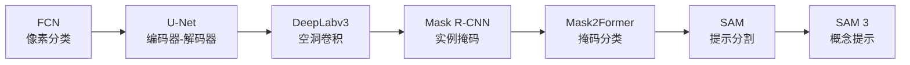
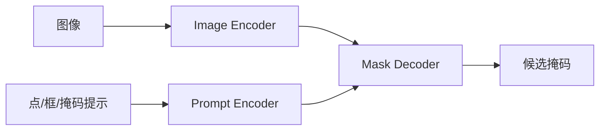
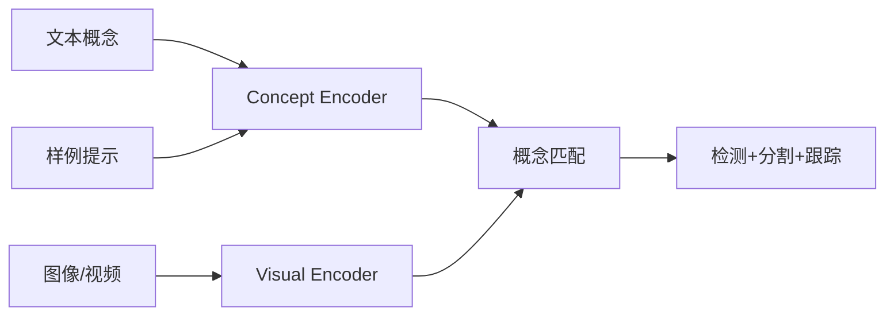

# 图像分割

!!! info "参考资料"
    **必读论文**

    - [Fully Convolutional Networks for Semantic Segmentation](https://openaccess.thecvf.com/content_cvpr_2015/html/Long_Fully_Convolutional_Networks_2015_CVPR_paper.html) — Long et al., CVPR 2015
    - [U-Net: Convolutional Networks for Biomedical Image Segmentation](https://arxiv.org/abs/1505.04597) — Ronneberger et al., MICCAI 2015
    - [Rethinking Atrous Convolution for Semantic Image Segmentation](https://arxiv.org/abs/1706.05587) — Chen et al., 2017
    - [Mask R-CNN](https://openaccess.thecvf.com/content_iccv_2017/html/He_Mask_R-CNN_ICCV_2017_paper.html) — He et al., ICCV 2017
    - [Masked-attention Mask Transformer for Universal Image Segmentation](https://arxiv.org/abs/2112.01527) — Cheng et al., CVPR 2022
    - [Segment Anything](https://ai.meta.com/research/publications/segment-anything/) — Kirillov et al., ICCV 2023
    - [SAM 3: Segment Anything with Concepts](https://openreview.net/forum?id=r35clVtGzw) — Carion et al., 2025

## 直觉 (Intuition)

图像分割不是给整张图或一个框贴标签，而是判断每个像素属于什么。输入是一张图，输出是一张或多张与图像对齐的掩码。困难在于模型既要理解“这是什么”，又要保留细到像素的边界。分割方法的演进一直在协调两个目标：更大的语义上下文和更精确的空间定位。提示分割又加入了第三个问题：用户想分的是哪一个概念或实例。

## 任务定义

“分割”包含几种不同任务：

| 任务 | 输出 | 是否区分同类实例 |
|------|------|------------------|
| 语义分割 | 每个像素的类别 | 否 |
| 实例分割 | 每个物体的类别与掩码 | 是 |
| 全景分割 | 所有前景实例和背景区域 | 是 |
| 提示分割 | 与点、框、文本或样例对应的掩码 | 取决于提示 |

语义分割常用交并比 (IoU) 和各类别平均后的 mIoU。实例分割常使用基于掩码 IoU 的 AP。全景分割使用 Panoptic Quality (PQ)，同时考虑识别是否正确和掩码是否准确。不同任务的指标不能直接横向比较。

## 发展脉络

*图像分割主线：从固定类别像素分类，走向实例级掩码，再走向由点、框、文本和样例驱动的提示分割。来源：本文示意图。*

### FCN：分类网络可以输出像素标签

早期语义分割常在像素或图像块上重复运行分类器，计算冗余，也难以端到端学习全图结构。

Fully Convolutional Network，简称 FCN（[Paper](https://openaccess.thecvf.com/content_cvpr_2015/html/Long_Fully_Convolutional_Networks_2015_CVPR_paper.html) | [Project](https://github.com/shelhamer/fcn.berkeleyvision.org)），把全连接层改成卷积层，使网络能接收任意尺寸图像并一次输出密集预测。深层特征提供语义，浅层特征通过跳跃连接补回空间细节。

FCN 建立了现代语义分割范式，但下采样造成的边界模糊仍很明显。

### U-Net：对称解码器把定位信息带回来

生物医学图像标注少、边界要求高，单纯上采样深层特征不够。

U-Net（[Paper](https://arxiv.org/abs/1505.04597) | [Project](https://lmb.informatik.uni-freiburg.de/people/ronneber/u-net/)）使用对称的编码器和解码器，并把编码阶段的高分辨率特征直接拼接到对应解码层。模型因此同时看到局部纹理和大范围语义。

*U-Net 通过左右对称的下采样和上采样路径，把语义上下文与高分辨率定位信息结合起来。来源：[U-Net 官方项目页](https://lmb.informatik.uni-freiburg.de/people/ronneber/u-net/)*

这种 U 形结构后来进入医学、遥感、生成模型和图像复原。它的局限是高分辨率特征占用显存大，简单拼接也不能保证模型真正利用了长距离上下文。

### DeepLabv3：不降分辨率也能扩大感受野

连续池化会损失空间细节，完全取消下采样又会使计算量过高。

DeepLabv3（[Paper](https://arxiv.org/abs/1706.05587)）使用空洞卷积在不增加参数量的情况下扩大采样范围，并用空洞空间金字塔池化 (Atrous Spatial Pyramid Pooling, ASPP) 聚合多个尺度的上下文。它说明密集预测不只需要更深的特征，还需要控制特征图分辨率与感受野的关系。

### Mask R-CNN：在检测框里预测实例掩码

语义分割会把相邻的两个人合成同一个“人”区域。实例分割需要先区分对象，再预测每个对象的像素范围。

Mask R-CNN（[Paper](https://openaccess.thecvf.com/content_iccv_2017/html/He_Mask_R-CNN_ICCV_2017_paper.html) | [Project](https://github.com/facebookresearch/Detectron)）在 Faster R-CNN 上增加并行掩码分支，并用 RoIAlign 避免候选区域特征的量化错位。它把检测和分割组合成一个清晰、可扩展的两阶段系统。

这种“先框后掩码”的结构依赖检测质量。漏掉的框无法靠掩码分支补回，拥挤场景也会受到候选和 NMS 的影响。

### Mask2Former：不同分割任务可以共享掩码分类

语义、实例和全景分割长期使用不同的专用头。Mask2Former（[Paper](https://arxiv.org/abs/2112.01527) | [Project](https://github.com/facebookresearch/Mask2Former)）把它们统一为一组 query 预测类别和掩码。masked attention 只在当前预测掩码覆盖的区域读取特征，减少无关位置干扰。

它把分割从“每个像素独立分类”进一步改写成“预测一组有语义的区域”，也连接了 DETR 的集合预测思想。

### SAM：从固定类别转向提示驱动

传统分割器的输出类别在训练时已经确定。面对新物体，通常要重新标注和微调。

Segment Anything Model，简称 SAM（[Paper](https://ai.meta.com/research/publications/segment-anything/) | [Project](https://github.com/facebookresearch/segment-anything)），用点、框或已有掩码提示目标区域，并通过大规模数据引擎训练可迁移的掩码生成能力。它更像一个分割基础组件，而不是直接回答固定语义类别的模型。

*SAM 把图像特征和提示特征分开编码，再由掩码解码器生成与提示对应的区域。来源：本文示意图。*

SAM 擅长“沿着提示切出一个区域”，但提示本身不一定包含语义。它可能给出视觉上合理、业务上错误的边界，在医学和遥感等分布外场景中仍需验证或适配。

### SAM 3：提示从位置扩展到概念

截至 2025 年，SAM 3（[Paper](https://openreview.net/forum?id=r35clVtGzw) | [Project](https://ai.meta.com/research/sam3/)）把点、框等视觉提示扩展到短文本和图像样例，并统一图像、视频中的检测、分割和跟踪。用户可以请求“所有黄色校车”，模型需要找到全部匹配实例并维持身份。

*SAM 3 的目标是把“位置提示”扩展到“概念提示”，并统一图像和视频中的检测、分割与跟踪。来源：本文示意图，参考 [SAM 3 官方项目页](https://ai.meta.com/research/sam3/)*

这一步把提示分割从“这里是什么区域”推进到“哪些区域符合这个概念”。概念边界、开放词汇误匹配和跨帧身份稳定性也成为新的问题。

## 核心方法

### 编码器、解码器与跳跃连接

编码器逐步降低空间分辨率，换取更大的感受野和更强语义。解码器恢复分辨率。跳跃连接把浅层边缘信息送到解码端，减少只靠低分辨率特征猜边界的困难。

### 像素分类与掩码分类

像素分类为每个位置预测类别，结构直接，但难以自然区分同类实例。掩码分类先预测若干区域，再给区域分类，更适合集合预测和统一分割任务。

### 提示编码

提示分割把点、框、文本或样例编码成条件，掩码解码器根据条件选择目标。提示不是额外装饰，它定义了任务。训练提示分布与实际交互方式不一致时，模型性能会明显下降。

## 工程实践

### 边界标注决定模型上限

半透明物体、头发、阴影和遮挡边界往往没有唯一答案。标注规范必须说明是否包含孔洞、模糊边缘和不可见部分。不同标注员的边界风格会直接反映在损失和评测中。

### 大图切块会制造接缝

遥感、病理切片和工业图像常需分块推理。没有重叠区域时，块边缘缺少上下文；简单拼接会出现断裂。常用做法是重叠滑窗、中心区域加权和多尺度推理。

!!! tip "工程重点"
    掩码后处理要与评测目标一致。形态学操作能让轮廓更平滑，也可能删掉细小结构。不要因为可视化更好看，就默认指标和业务效果会提高。

### 基础分割模型适合标注提效，不等于免标注

SAM 系模型可以生成初始掩码，人工只做修正。对专业数据，应记录修正比例和常见失败类型，再决定是否微调。把自动掩码直接当真值，会把模型偏差写回训练集。

## 开放问题

以下判断基于截至 2026 年 6 月公开的论文与项目资料。

- **开放概念仍有歧义。** 文本中的“零件”“损伤区域”或“可抓取部分”依赖领域定义，通用视觉语义不能自动替代任务规范。
- **细结构和透明区域仍困难。** 细线、反光、烟雾、玻璃和毛发对分辨率、标注和损失都敏感。
- **视频身份容易漂移。** 遮挡、出画再进入和相似实例会破坏长期一致性，单帧掩码质量不能代表视频可用性。
- **可靠性难评估。** 模型通常给出一张确定掩码，但很少说明哪些边界不确定。高风险场景需要可校准的不确定性和人工复核接口。
- **大规模提示模型的成本仍高。** 高分辨率编码、视频记忆和多实例输出会增加显存与延迟，端侧部署仍需专门压缩。
