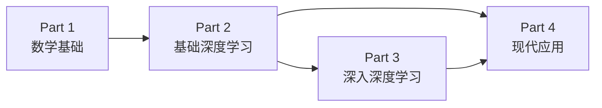

# 深度学习入门指南

欢迎。这本书写给刚开始学 AI 的同学——有大学数学基础，想系统搞懂深度学习，能看懂论文，也能应对面试。

## 如何使用这本书

按顺序读完 Part 1（数学基础）再进入 Part 2，是最稳的路径。
如果你数学基础不错，可以直接从 Part 2 开始，遇到不熟悉的概念再回来查。

## 学习路线图

## 四个部分

| 部分 | 内容 | 适合 |
|------|------|------|
| [Part 1 · 数学基础](01-math/index.md) | 线性代数、概率论、优化理论 | 所有人 |
| [Part 2 · 基础深度学习](02-deep-learning/index.md) | 梯度下降、反向传播、CNN、RNN、Transformer | 有 Part 1 基础 |
| [Part 3 · 深入深度学习](03-advanced/index.md) | VAE、扩散模型、强化学习 | 有 Part 2 基础 |
| [Part 4 · 现代应用](04-applications/index.md) | 3D 视觉、多模态、Agent、具身智能 | 有 Part 2/3 基础 |
