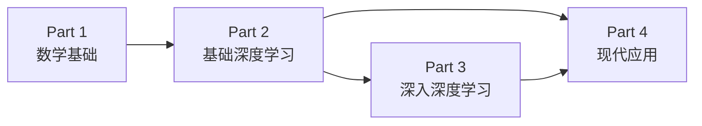

# 深度学习入门指南

欢迎。这本书写给刚开始学 AI 的同学——有大学数学基础，想系统搞懂深度学习，能有一个知识脉络，也希望能在面试中脱颖而出。

笔者能力有限，借助 ChatGPT 和Claude 的帮助写了这本书，难免有不严谨或者不清晰的地方，欢迎大家指出来，我会持续改进。

## 如何使用这本书

不一定要按顺序读完 Part 1（数学基础）再看后面的部分，但希望大家能有好的数学基础，能让你有更深入的理解。

可以先跳过去看后面章节的内容，看看它在解决什么问题。如有必要和不理解的地方，再回过头来读数学部分。

## 学习路线图

## 四个部分

| 部分 | 内容 | 适合 |
|------|------|------|
| [Part 1 · 数学基础](01-math/index.md) | 线性代数、概率论、优化理论 | 所有人 |
| [Part 2 · 基础深度学习](02-deep-learning/index.md) | 梯度下降、反向传播、CNN、RNN、Transformer | 有 Part 1 基础 |
| [Part 3 · 深入深度学习](03-advanced/index.md) | VAE、扩散模型、强化学习 | 有 Part 2 基础 |
| [Part 4 · 现代应用](04-applications/index.md) | 3D 视觉、多模态、Agent、具身智能 | 有 Part 2 & 3 基础 |

# 参考资源
- 课程：李宏毅《机器学习》《生成模型》课程
- 视频：3b1b 线性代数的本质、深度学习入门
- [论文代码讲解](https://github.com/labmlai/annotated_deep_learning_paper_implementations)
- [课程笔记参考](https://maximiliandu.com/course_notes.html)